# Jarkom Modul 2 Shadow Net Operation

**Kelompok K-68 (Group C) Praktikum Komunikasi Data dan Jaringan Komputer 2026**

| | |
|---|---|
| Domain | `K68.com` |
| Prefix IP | `192.245.0.0/16` |
| Image | `ardhptr21/debinet:latest` |
| Controller | GNS3 remote, Group C |

## Anggota dan Pembagian

| Nama | NRP | Soal |
|---|---|---|
| Ryan Adya Purwanto | 5027231046 | 1 - 9 |
| Made Gde Krisna Wangsa | 5027201047 | 10 - 20 |

Laporan ini mencakup **soal 1 sampai 15**.

---

## Daftar Isi

- [Topologi](#topologi)
- [Pembagian IP](#pembagian-ip)
- [Catatan Teknis Penting](#catatan-teknis-penting)
- [Soal 1: Topologi dan Pengalamatan IP](#soal-1-topologi-dan-pengalamatan-ip)
- [Soal 2: WAN dan NAT](#soal-2-wan-dan-nat)
- [Soal 3: Routing Internal dan Resolver Awal](#soal-3-routing-internal-dan-resolver-awal)
- [Soal 4: Zona DNS Master dan Slave](#soal-4-zona-dns-master-dan-slave)
- [Soal 5: Hostname dan Domain per Node](#soal-5-hostname-dan-domain-per-node)
- [Soal 6: Verifikasi Zone Transfer](#soal-6-verifikasi-zone-transfer)
- [Soal 7: Record vault, core, dan CNAME](#soal-7-record-vault-core-dan-cname)
- [Soal 8: Reverse Zone dan PTR](#soal-8-reverse-zone-dan-ptr)
- [Soal 9: Web Statis dan Autoindex](#soal-9-web-statis-dan-autoindex)
- [Soal 10: Web Dinamis dan Rewrite URL](#soal-10-web-dinamis-dan-rewrite-url)
- [Soal 11: Reverse Proxy dan Load Balancer](#soal-11-reverse-proxy-dan-load-balancer)
- [Soal 12: Basic Authentication](#soal-12-basic-authentication)
- [Soal 13: Redirection](#soal-13-redirection)
- [Soal 14: Forwarding Real IP ke Access Log Backend](#soal-14-forwarding-real-ip-ke-access-log-backend)
- [Soal 15: Jalur Proxy Khusus](#soal-15-jalur-proxy-khusus)
- [Soal 16: Stress Test dengan ApacheBench](#soal-16-stress-test-dengan-apachebench)
- [Soal 17: TXT Record untuk Klien Sayap Kiri dan Kanan](#soal-17-txt-record-untuk-klien-sayap-kiri-dan-kanan)
- [Soal 18: Perubahan A Record dan Verifikasi Tiga Fase TTL
](#soal-18-perubahan-a-record-dan-verifikasi-tiga-fase-ttl)
- [Soal 19: CNAME ke Domain Eksternal http.badssl.com](#soal-19-cname-ke-domain-eksternal-httpbadsslcom)
- [Soal 20: Autostart Service dan Konfigurasi Setelah Restart
](#soal-20-autostart-service-dan-konfigurasi-setelah-restart)
- [Struktur Repository](#struktur-repository)

---

## Topologi


Tujuh switch, lima di antaranya tersambung langsung ke router `rootkit`:

```
rootkit --+-- eth1 -- Switch6 -- alpha, beta, gamma
          +-- eth2 -- Switch7 -- delta, epsilon
          +-- eth3 -- Switch4 -- abbey
          +-- eth4 -- Switch5 -- penny
          +-- eth5 -- Switch1 --+-- Switch2 -- prab, tedd
                                +-- Switch3 -- obladi, desmond, oblada, molly
eth0 -- NAT1 (DHCP)
```

Switch2 dan Switch3 tidak tersambung ke rootkit melainkan ke Switch1. Karena switch bekerja di layer 2 dan tidak memisahkan jaringan, ketiganya membentuk **satu broadcast domain**, sehingga prab, tedd, obladi, desmond, oblada, dan molly berada dalam **satu subnet** dan dilayani oleh satu interface router saja (`eth5`).

## Pembagian IP

| Interface rootkit | Switch | Subnet | Node |
|---|---|---|---|
| eth1 | Switch6 | 192.245.1.0/24 | alpha, beta, gamma |
| eth2 | Switch7 | 192.245.2.0/24 | delta, epsilon |
| eth3 | Switch4 | 192.245.3.0/24 | abbey |
| eth4 | Switch5 | 192.245.4.0/24 | penny |
| eth5 | Switch1+2+3 | 192.245.5.0/24 | prab, tedd, obladi, desmond, oblada, molly |

| Node | IP | Gateway |
|---|---|---|
| rootkit eth1 | 192.245.1.1 | - |
| rootkit eth2 | 192.245.2.1 | - |
| rootkit eth3 | 192.245.3.1 | - |
| rootkit eth4 | 192.245.4.1 | - |
| rootkit eth5 | 192.245.5.1 | - |
| alpha | 192.245.1.2 | 192.245.1.1 |
| beta | 192.245.1.3 | 192.245.1.1 |
| gamma | 192.245.1.4 | 192.245.1.1 |
| delta | 192.245.2.2 | 192.245.2.1 |
| epsilon | 192.245.2.3 | 192.245.2.1 |
| abbey | 192.245.3.2 | 192.245.3.1 |
| penny | 192.245.4.2 | 192.245.4.1 |
| prab | 192.245.5.2 | 192.245.5.1 |
| tedd | 192.245.5.3 | 192.245.5.1 |
| obladi | 192.245.5.4 | 192.245.5.1 |
| desmond | 192.245.5.5 | 192.245.5.1 |
| oblada | 192.245.5.6 | 192.245.5.1 |
| molly | 192.245.5.7 | 192.245.5.1 |

`eth0` rootkit memakai DHCP dari NAT dan memperoleh `192.168.122.69/24`.

---

## Catatan Teknis Penting

Tiga kendala lingkungan yang menentukan cara seluruh konfigurasi ditulis.

**1. Hanya `/root` dan `/etc/network/interfaces` yang bertahan saat node restart.**
Node Docker kembali ke kondisi image setiap kali dinyalakan ulang. Akibatnya `/etc/bind`, `/etc/apache2`, dan `/etc/resolv.conf` akan hilang. Karena itu seluruh konfigurasi tidak diketik langsung ke lokasi aslinya, melainkan ditulis oleh **script yang disimpan di `/root`**, lalu script itu dipanggil dari `/etc/network/interfaces` melalui baris `up`. Pendekatan ini sekaligus memenuhi aturan praktikum yang mewajibkan script instalasi dan konfigurasi diletakkan di `/root`.

**2. Editor "Edit network configuration" GNS3 membuang baris yang mengandung karakter `>`.**
Karena itu perintah pengalihan output tidak boleh ditulis langsung di `interfaces`. Solusinya, perintah tersebut disembunyikan di dalam file script (`dns.sh`, `nat.sh`), dan `interfaces` hanya memanggilnya dengan `up bash /root/dns.sh`.

**3. Jumlah adapter dinaikkan per node, bukan lewat template global.**
`rootkit` memerlukan enam interface (`eth0`-`eth5`), sementara template default hanya menyediakan lebih sedikit. Karena praktikum berjalan di **remote controller yang dipakai bersama seluruh kelompok**, mengubah template global akan berdampak ke kelompok lain. Perubahan dilakukan lewat klik kanan node → Configure → Network → Adapters = 8, hanya pada `rootkit`.

---

## Soal 1: Topologi dan Pengalamatan IP

> Sebagai pusat kesadaran The Mesh, rootkit harus merentangkan koneksinya ke lima gerbang utama (Switch). Tetapkan alamat IP dan default gateway untuk seluruh Entitas, mulai dari para operator (alpha, beta, gamma), penjaga directory (prab, tedd), gerbang penyaring (abbey, penny), hingga repository (obladi, desmond, oblada, molly) sesuai dengan topologi pembagian switch yang dirancang.

### Langkah Pengerjaan

**1. Menyiapkan node dan switch.**
Empat belas node DebiNet, tujuh Ethernet switch, dan satu node NAT disusun sesuai gambar topologi.

**2. Menaikkan jumlah adapter rootkit menjadi 8.**
Dilakukan lewat klik kanan node → Configure → tab Network → Adapters, dalam keadaan node mati. Perubahan dilakukan **per node**, bukan lewat Edit → Preferences, karena template pada remote controller dipakai bersama seluruh kelompok.

**3. Menyambung kabel berurutan dari `eth0` di sisi rootkit.**
Nama interface di dalam node ditentukan oleh nomor slot adapter di GNS3. Kabel yang tertukar menghasilkan konfigurasi yang benar secara sintaks tetapi terpasang di jaringan yang salah.

| Port rootkit | Tujuan |
|---|---|
| eth0 | NAT1 |
| eth1 | Switch6 |
| eth2 | Switch7 |
| eth3 | Switch4 |
| eth4 | Switch5 |
| eth5 | Switch1 |

**4. Menulis konfigurasi IP** lewat klik kanan node → **Edit network configuration** (node dalam keadaan mati), yang mengedit `/etc/network/interfaces`.

### Script dan Konfigurasi

**rootkit** - `/etc/network/interfaces` - [`config/rootkit/interfaces`](config/rootkit/interfaces)

```
auto eth0
iface eth0 inet dhcp

auto eth1
iface eth1 inet static
	address 192.245.1.1
	netmask 255.255.255.0

auto eth2
iface eth2 inet static
	address 192.245.2.1
	netmask 255.255.255.0

auto eth3
iface eth3 inet static
	address 192.245.3.1
	netmask 255.255.255.0

auto eth4
iface eth4 inet static
	address 192.245.4.1
	netmask 255.255.255.0

auto eth5
iface eth5 inet static
	address 192.245.5.1
	netmask 255.255.255.0
```

Interface `eth1`-`eth5` sengaja **tidak diberi baris `gateway`**. Default gateway hanya boleh ada satu per host, dan bagi router jalur keluarnya adalah `eth0` yang sudah memperolehnya otomatis dari DHCP NAT. Menambahkan gateway di interface LAN akan membuat router mengarahkan trafik keluar ke jaringan internalnya sendiri.

**13 node non-router** - `/etc/network/interfaces` - [`config/interfaces/`](config/interfaces/)

Pola yang sama di semua node, hanya `address` dan `gateway` yang berbeda. Contoh alpha:

```
auto eth0
iface eth0 inet static
	address 192.245.1.2
	netmask 255.255.255.0
	gateway 192.245.1.1
```

| Node | address | gateway |
|---|---|---|
| alpha | 192.245.1.2 | 192.245.1.1 |
| beta | 192.245.1.3 | 192.245.1.1 |
| gamma | 192.245.1.4 | 192.245.1.1 |
| delta | 192.245.2.2 | 192.245.2.1 |
| epsilon | 192.245.2.3 | 192.245.2.1 |
| abbey | 192.245.3.2 | 192.245.3.1 |
| penny | 192.245.4.2 | 192.245.4.1 |
| prab | 192.245.5.2 | 192.245.5.1 |
| tedd | 192.245.5.3 | 192.245.5.1 |
| obladi | 192.245.5.4 | 192.245.5.1 |
| desmond | 192.245.5.5 | 192.245.5.1 |
| oblada | 192.245.5.6 | 192.245.5.1 |
| molly | 192.245.5.7 | 192.245.5.1 |

> Pada soal 3 setiap blok `iface` ini ditambah baris `up bash /root/dns.sh`, dan pada soal 20 baris tersebut diganti menjadi `up bash /root/start-all.sh`.

### Pengujian


| Uji | Hasil |
|---|---|
| `ip a` di rootkit | eth1-eth5 memegang IP sesuai rancangan |
| alpha → 192.245.1.1 | berhasil, gateway terjangkau |
| alpha → beta | berhasil, komunikasi sesubnet |
| prab → obladi | berhasil, membuktikan cascade Switch1-2-3 benar-benar satu subnet |

---

## Soal 2: WAN dan NAT

> Meskipun The Mesh beroperasi dalam bayang-bayang, Rootkit menyadari bahwa Entitas di dalamnya masih membutuhkan asupan paket dari dunia luar. Buka jalur menuju NAT dengan memastikan antarmuka WAN di router rootkit aktif. Konfigurasikan NAT agar dapat meneruskan lalu lintas keluar bagi seluruh alamat internal, sehingga semua host di dalam jaringan dapat menjangkau internet publik menggunakan IP address.

### Langkah Pengerjaan

**1. Memastikan `eth0` aktif dan memperoleh alamat dari NAT.**
Diperiksa dengan `ip a show eth0`, memperoleh `192.168.122.69/24`.

**2. Menulis script NAT di `/root/nat.sh`.**
Diletakkan di `/root` karena hanya direktori itu dan `/etc/network/interfaces` yang bertahan saat node restart.

**3. Menjalankan script dan memverifikasi aturan iptables.**

### Script dan Konfigurasi

**rootkit** - `/root/nat.sh` - [`config/rootkit/nat.sh`](config/rootkit/nat.sh)

```bash
#!/bin/bash
sysctl -w net.ipv4.ip_forward=1
iptables -t nat -A POSTROUTING -o eth0 -j MASQUERADE
```

Perintah yang dijalankan di konsol rootkit:

```bash
cat > /root/nat.sh <<'EOF'
#!/bin/bash
sysctl -w net.ipv4.ip_forward=1
iptables -t nat -A POSTROUTING -o eth0 -j MASQUERADE
EOF
chmod +x /root/nat.sh
bash /root/nat.sh
```

`ip_forward` mengizinkan kernel meneruskan paket antar interface. Tanpa ini node hanya bisa berbicara dengan tetangga sesubnet.

`MASQUERADE` dipilih daripada `SNAT` karena alamat `eth0` diperoleh lewat DHCP dan bisa berubah. `MASQUERADE` membaca alamat interface secara dinamis, sedangkan `SNAT` memerlukan alamat yang ditulis tetap.

> Pada soal 20, baris `iptables -A` diganti menjadi pola `-C ... || -A` agar aturan tidak menumpuk setiap kali script dipanggil saat boot.

### Pengujian


| Uji | Hasil |
|---|---|
| `iptables -t nat -L POSTROUTING -n -v` | aturan `MASQUERADE ... out:eth0` terpasang |
| `ip a show eth0` | 192.168.122.69/24 diterima dari NAT |
| alpha → 8.8.8.8 | berhasil, ttl 110 |

---

## Soal 3: Routing Internal dan Resolver Awal

> Jaringan rahasia tidak akan berfungsi tanpa sinkronisasi antar divisi. Pastikan seluruh Entitas dapat saling terhubung dan berkomunikasi lintas jalur (routing internal via rootkit berfungsi). Untuk menghindari fragmentasi saat persiapan, pastikan setiap host non-router menambahkan resolver 192.168.122.1 saat antarmukanya aktif agar akses untuk mengunduh paket instalasi dari internet tersedia sejak awal beroperasi.

### Langkah Pengerjaan

**1. Routing antar subnet tidak memerlukan konfigurasi tambahan.**
Begitu `ip_forward=1` aktif di rootkit dan setiap node memiliki default gateway yang benar, router sudah mengenal kelima subnet secara langsung melalui interface-nya masing-masing.

**2. Membuat `/root/dns.sh` di 13 node non-router** (node dalam keadaan hidup).

**3. Memasang pemanggil di `/etc/network/interfaces`** (node dalam keadaan mati).

Frasa **"saat antarmukanya aktif"** pada soal menentukan cara pengerjaannya. `/etc/resolv.conf` termasuk file yang hilang setiap node restart, sehingga resolver tidak boleh diketik manual melainkan harus dipasang ulang otomatis setiap interface naik.

### Script dan Konfigurasi

**13 node non-router** - `/root/dns.sh` (versi soal 3)

```bash
echo "nameserver 192.168.122.1" > /etc/resolv.conf
```

Perintah yang dijalankan di konsol tiap node:

```bash
cat > /root/dns.sh <<'EOF'
echo "nameserver 192.168.122.1" > /etc/resolv.conf
EOF
chmod +x /root/dns.sh
bash /root/dns.sh
```

**13 node non-router** - `/etc/network/interfaces`, satu baris ditambahkan di bawah `gateway`:

```
	up bash /root/dns.sh
```

Sehingga blok `iface` alpha menjadi:

```
auto eth0
iface eth0 inet static
	address 192.245.1.2
	netmask 255.255.255.0
	gateway 192.245.1.1
	up bash /root/dns.sh
```

**rootkit** - `/etc/network/interfaces`, pemanggil NAT ditambahkan:

```
auto eth0
iface eth0 inet dhcp
	up bash /root/nat.sh
```

Perintah pengalihan `>` sengaja ditempatkan **di dalam file script**, bukan langsung sebagai baris `up`. Editor "Edit network configuration" GNS3 membuang baris yang memuat karakter `>`, sehingga penulisan langsung akan hilang tanpa peringatan.

> Isi `dns.sh` diperluas pada soal 4 (urutan resolver prab → tedd → 192.168.122.1) dan soal 5 (penulisan `/etc/hosts`). Versi finalnya ada di [`config/dns.sh`](config/dns.sh).

### Pengujian


| Uji | Hasil |
|---|---|
| alpha → molly (subnet 1 ke 5) | berhasil, ttl 63 |
| alpha → abbey (subnet 1 ke 3) | berhasil, ttl 63 |
| molly → alpha | berhasil, arah sebaliknya |
| `cat /etc/resolv.conf` | resolver terpasang otomatis |

Nilai **ttl 63** menunjukkan paket melewati tepat satu router, sesuai rancangan.

---

## Soal 4: Zona DNS Master dan Slave

> Penjaga Direktori mulai menuliskan hukum The Mesh. Pada node prab, bangun zona `K68.com` sebagai authoritative dengan SOA yang menunjuk ke `prab.K68.com`, serta tambahkan catatan NS untuk `prab.K68.com` dan `tedd.K68.com`. Buat A record untuk keduanya yang mengarah ke alamat IP mereka masing-masing, serta A record apex `K68.com` yang mengarah ke gerbang aplikasi dinamis (penny). Aktifkan fitur notify dan allow-transfer ke tedd, lalu set forwarders ke 192.168.122.1. Di node tedd, tarik zona dari master dan pastikan server menjawab secara authoritative. Setelah itu, perbarui urutan resolver pada seluruh Entitas non-router menjadi: IP prab, IP tedd, lalu 192.168.122.1.

### Langkah Pengerjaan

**1. Menulis seluruh konfigurasi BIND sebagai script di `/root/setup-dns.sh`,** bukan mengetik langsung ke `/etc/bind`. Direktori `/etc/bind` hilang setiap node restart, sehingga konfigurasi harus dapat dibangun ulang dari `/root`.

**2. Menjalankan script di prab, lalu memverifikasi dengan `named-checkconf` dan `named-checkzone`.**

**3. Menjalankan script serupa di tedd dengan `type slave`.**

**4. Memperbarui urutan resolver di 13 node non-router.**

### Script dan Konfigurasi

**prab (ns1, master)** - `/root/setup-dns.sh` - [`config/prab/setup-dns.sh`](config/prab/setup-dns.sh)

```bash
#!/bin/bash
apt-get update -y
apt-get install -y bind9 dnsutils
ln -sf /etc/init.d/named /etc/init.d/bind9
mkdir -p /etc/bind/jarkom

cat > /etc/bind/named.conf.local <<'EOF'
zone "K68.com" {
    type master;
    notify yes;
    also-notify { 192.245.5.3; };
    allow-transfer { 192.245.5.3; };
    file "/etc/bind/jarkom/K68.com";
};
EOF

cat > /etc/bind/named.conf.options <<'EOF'
options {
    directory "/var/cache/bind";
    forwarders {
        192.168.122.1;
    };
    dnssec-validation no;
    allow-query { any; };
    auth-nxdomain no;
    listen-on-v6 { any; };
};
EOF

cat > /etc/bind/jarkom/K68.com <<'EOF'
$TTL    604800
@       IN      SOA     prab.K68.com. root.K68.com. (
                        2026093001 ; Serial
                        604800     ; Refresh
                        86400      ; Retry
                        2419200    ; Expire
                        604800 )   ; Negative Cache TTL
;
@       IN      NS      prab.K68.com.
@       IN      NS      tedd.K68.com.
@       IN      A       192.245.4.2

prab    IN      A       192.245.5.2
tedd    IN      A       192.245.5.3
EOF

service bind9 restart
```


`notify yes` membuat master mengabari slave setiap zona berubah, `also-notify` menyebut alamat slave secara eksplisit, dan `allow-transfer` memberi izin slave menarik salinan zona. Ketiganya harus ada - tanpa `allow-transfer`, notify tetap terkirim tetapi transfer akan ditolak.

`forwarders` mengarahkan pertanyaan di luar zona `K68.com` ke DNS milik NAT, sehingga node tetap dapat membuka alamat internet meski resolver-nya sudah diarahkan ke prab.


**tedd (ns2, slave)** - `/root/setup-dns.sh` - [`config/tedd/setup-dns.sh`](config/tedd/setup-dns.sh)

```bash
#!/bin/bash
apt-get update -y
apt-get install -y bind9 dnsutils
ln -sf /etc/init.d/named /etc/init.d/bind9
mkdir -p /etc/bind/jarkom
chown -R bind:bind /etc/bind/jarkom

cat > /etc/bind/named.conf.local <<'EOF'
zone "K68.com" {
    type slave;
    masters { 192.245.5.2; };
    file "/etc/bind/jarkom/K68.com";
};
EOF

cat > /etc/bind/named.conf.options <<'EOF'
options {
    directory "/var/cache/bind";
    forwarders {
        192.168.122.1;
    };
    dnssec-validation no;
    allow-query { any; };
    auth-nxdomain no;
    listen-on-v6 { any; };
};
EOF

service bind9 restart
```


Baris `chown -R bind:bind /etc/bind/jarkom` bersifat wajib pada slave. File hasil zone transfer ditulis oleh proses `named` yang berjalan sebagai user `bind`; tanpa kepemilikan yang benar, transfer akan gagal dan zona tidak pernah termuat.

**13 node non-router** - `/root/dns.sh` diperbarui, resolver diurutkan ulang:

```bash
echo "nameserver 192.245.5.2" > /etc/resolv.conf
echo "nameserver 192.245.5.3" >> /etc/resolv.conf
echo "nameserver 192.168.122.1" >> /etc/resolv.conf
```

### Pengujian


| Uji | Hasil |
|---|---|
| `dig @192.245.5.2 K68.com` | apex → 192.245.4.2, flag `aa` |
| `dig @192.245.5.3 K68.com` | jawaban identik dari slave, flag `aa` |
| `dig K68.com` tanpa `@` | dijawab lewat resolver, flag `aa` |
| `dig prab.K68.com` / `dig tedd.K68.com` | sesuai alamat masing-masing |

Flag **`aa`** (authoritative answer) pada jawaban kedua server menandakan keduanya benar-benar memegang zona, bukan sekadar meneruskan atau menyajikan cache.

---

## Soal 5: Hostname dan Domain per Node

> "Entitas tanpa identitas adalah anomali," pesan Rootkit. Namai semua Entitas (hostname) sesuai glosarium dan verifikasi bahwa setiap host mengenali hostname tersebut secara system-wide. Buat setiap domain untuk masing-masing node sesuai dengan namanya dan assign IP masing-masing juga. Lakukan pengecualian untuk node yang bertanggung jawab atas prab dan tedd.

### Langkah Pengerjaan

**1. Hostname pendek tidak perlu dikonfigurasi.**
GNS3 sudah menetapkannya dari nama node, terbukti dari prompt `root@alpha:~#`.

**2. Memperbaiki `hostname -f` yang masih mengembalikan nama pendek.**
Penyebabnya, `/etc/hosts` bawaan container hanya memuat pasangan alamat dan nama pendek, dan `hostname -f` membaca `/etc/hosts` lebih dahulu daripada DNS. Menambahkan `search` saja tidak menolong karena berkas lokal selalu diperiksa lebih dulu.

**3. Menambah 12 A record ke zona di prab dan menaikkan serial.**

### Script dan Konfigurasi

**13 node non-router** - `/root/dns.sh` versi final - [`config/dns.sh`](config/dns.sh)

```bash
echo "search K68.com" > /etc/resolv.conf
echo "nameserver 192.245.5.2" >> /etc/resolv.conf
echo "nameserver 192.245.5.3" >> /etc/resolv.conf
echo "nameserver 192.168.122.1" >> /etc/resolv.conf

NAME=$(hostname -s)
IP=$(ip -4 addr show eth0 | awk '/inet /{print $2}' | cut -d/ -f1)

grep -vw "$NAME" /etc/hosts > /root/hosts.tmp
if [ -n "$IP" ]; then
    echo "$IP $NAME.K68.com $NAME" >> /root/hosts.tmp
fi
cat /root/hosts.tmp > /etc/hosts
```

Script dibuat generik - membaca hostname dan alamat node sendiri - sehingga isinya identik di ketiga belas node dan tidak perlu disesuaikan satu per satu.

**Catatan penting mengenai pengambilan alamat IP.** Versi pertama script ini memakai `hostname -I`. Perintah tersebut berhasil ketika script dijalankan manual dari konsol, sehingga pengujian soal 5 lolos. Namun ketika script dipanggil oleh hook `up` saat node melakukan boot, `PATH` yang berlaku minimal dan `hostname` menunjuk ke **BusyBox**, yang tidak mendukung flag `-I`. Akibatnya variabel `IP` kosong dan baris yang ditulis ke `/etc/hosts` menjadi cacat (` nama.K68.com nama` tanpa alamat), sehingga `hostname -f` gagal setiap kali node dinyalakan ulang.

Kegagalan ini baru terlihat setelah soal 20 memindahkan pemanggilan script ke proses boot. Perbaikannya dua lapis: alamat diambil dengan `ip -4 addr show eth0` yang tersedia baik di BusyBox maupun coreutils, dan ditambahkan penjaga `if [ -n "$IP" ]` agar baris cacat tidak pernah ditulis sekalipun pengambilan alamat gagal.

**rootkit** - `/root/hostname.sh` - [`config/rootkit/hostname.sh`](config/rootkit/hostname.sh)

rootkit memiliki banyak alamat sehingga tidak bisa memakai script generik di atas:

```bash
#!/bin/bash
grep -vw rootkit /etc/hosts > /root/hosts.tmp
echo "192.245.1.1 rootkit.K68.com rootkit" >> /root/hosts.tmp
cat /root/hosts.tmp > /etc/hosts
```

**prab** - tambahan pada `/etc/bind/jarkom/K68.com`, serial dinaikkan ke `2026093002`:

```
rootkit IN      A       192.245.1.1
alpha   IN      A       192.245.1.2
beta    IN      A       192.245.1.3
gamma   IN      A       192.245.1.4
delta   IN      A       192.245.2.2
epsilon IN      A       192.245.2.3
abbey   IN      A       192.245.3.2
penny   IN      A       192.245.4.2
obladi  IN      A       192.245.5.4
desmond IN      A       192.245.5.5
oblada  IN      A       192.245.5.6
molly   IN      A       192.245.5.7
```


**prab dan tedd dikecualikan** dari penambahan A record karena keduanya sudah memilikinya sejak soal 4; menambahkannya lagi akan menghasilkan duplikat.

Perlu dibedakan: pengecualian ini hanya berlaku untuk A record di zona. Untuk `dns.sh`, prab dan tedd **tetap ikut** karena soal 4 meminta resolver diurutkan ulang pada seluruh Entitas non-router.

### Pengujian


| Uji | Hasil |
|---|---|
| `hostname -f` di delta, penny, beta, abbey | mengembalikan FQDN lengkap |
| `dig <node>.K68.com +short` | seluruh node sesuai tabel alamat |

### Kendala yang Ditemui

Setelah konfigurasi diperbarui, seluruh kueri DNS gagal dengan `connection refused` dari prab maupun tedd.

Pemeriksaan pertama di tedd menghasilkan ratusan baris `line 1: syntax error` dari `named-checkzone`. **Diagnosa ini menyesatkan.** File zona pada server slave disimpan BIND dalam format raw (biner), bukan teks, sehingga `named-checkzone` memang tidak dapat membacanya. Error tersebut normal dan bukan penyebab masalah.

Pemeriksaan ulang dilakukan di master. File zona terbukti sehat - 27 baris, `named-checkzone` mengembalikan `OK`, serial terbaca `2026093002`. Yang bermasalah adalah `service bind9 status` yang melaporkan `bind is not running`. Node sempat dimatikan untuk mengedit `interfaces`, dan BIND tidak menyala otomatis saat node dihidupkan kembali. Perbaikannya menjalankan `service bind9 start` di prab dan tedd.

Urutan diagnosa yang benar untuk kasus DNS mati: periksa status service di **master** lebih dahulu, jalankan `named-checkzone` hanya di master, baru periksa slave. Persistensi service inilah yang kemudian diselesaikan pada soal 20.

---

## Soal 6: Verifikasi Zone Transfer

> Pastikan zone transfer berjalan, pastikan tedd telah menerima salinan zona terbaru dari prab. Nilai serial SOA di keduanya harus sama karena keduanya tidak bisa dipisahkan dan saling melengkapi.

### Langkah Pengerjaan

Soal ini **tidak memerlukan script atau konfigurasi baru**. Seluruh mekanismenya sudah dipasang pada soal 4:

| Sisi | Konfigurasi | Fungsi |
|---|---|---|
| prab (master) | `notify yes` | mengabari slave setiap zona berubah |
| prab (master) | `also-notify { 192.245.5.3; }` | menyebut alamat slave secara eksplisit |
| prab (master) | `allow-transfer { 192.245.5.3; }` | mengizinkan slave menarik salinan zona |
| tedd (slave) | `type slave` + `masters { 192.245.5.2; }` | menarik zona dari master |

Yang dibuktikan adalah bahwa mekanisme tersebut benar-benar bekerja: serial di tedd ikut naik menjadi `2026093002` setelah zona diubah pada soal 5, **tanpa disentuh secara manual**.

Apabila slave tertinggal, transfer dapat dipaksa dari tedd dengan:

```bash
rndc retransfer K68.com
```

### Pengujian


```bash
dig @192.245.5.2 K68.com SOA +short
dig @192.245.5.3 K68.com SOA +short
```

Kedua server mengembalikan serial `2026093002`.

Log transfer tidak dapat dilampirkan karena container DebiNet tidak menjalankan syslog (`/var/log/syslog` tidak tersedia) maupun systemd (`journalctl` tidak tersedia). Hal ini normal untuk image tersebut. Kesamaan serial sudah merupakan bukti yang cukup, sebab nilai itu mustahil sama apabila transfer gagal.

---

## Soal 7: Record vault, core, dan CNAME

> Tambahkan pada zona `K68.com` A record untuk `vault.K68.com` (IP obladi & desmond), dan `core.K68.com` (IP oblada & molly). Tetapkan CNAME `www.K68.com` → `penny.K68.com` dan `static.K68.com` → `abbey.K68.com`. Verifikasi dari dua klien berbeda bahwa seluruh hostname tersebut ter-resolve ke tujuan yang benar dan konsisten.

### Langkah Pengerjaan

**1. Menambahkan empat nama baru ke zona di prab.**
**2. Menaikkan serial ke `2026093003` dan menjalankan ulang `setup-dns.sh`.**
**3. Memastikan tedd ikut tersinkron.**
**4. Menguji dari dua klien berbeda** sesuai permintaan eksplisit soal.

### Script dan Konfigurasi

**prab** - tambahan pada `/etc/bind/jarkom/K68.com`:

```
vault   IN      A       192.245.5.4
vault   IN      A       192.245.5.5
core    IN      A       192.245.5.6
core    IN      A       192.245.5.7

www     IN      CNAME   penny.K68.com.
static  IN      CNAME   abbey.K68.com.
```


`vault` dan `core` masing-masing memiliki **dua A record** karena kedua area tersebut terdiri dari sepasang node, bukan satu. Satu nama dengan dua A record membuat DNS memutar urutan jawaban setiap kali ditanya, dan inilah dasar pembagian beban yang dipakai pada soal 11.

Kedua CNAME **wajib diakhiri titik**. Tanpa titik penutup, BIND memperlakukan nilainya sebagai nama relatif dan menambahkan nama zona sekali lagi, sehingga `penny.K68.com` menjadi `penny.K68.com.K68.com`.

### Pengujian

Dilakukan dari **alpha** (subnet 1) dan **delta** (subnet 2).


| Nama | Hasil |
|---|---|
| `vault.K68.com` | 192.245.5.4 dan 192.245.5.5 |
| `core.K68.com` | 192.245.5.6 dan 192.245.5.7 |
| `www.K68.com` | `penny.K68.com.` → 192.245.4.2 |
| `static.K68.com` | `abbey.K68.com.` → 192.245.3.2 |

Urutan kedua alamat pada `vault` berbeda antara alpha dan delta. Ini bukan ketidakkonsistenan melainkan **round-robin** DNS yang bekerja sebagaimana mestinya - himpunan jawabannya identik, hanya urutannya yang diputar.

---

## Soal 8: Reverse Zone dan PTR

> Di prab (ns1) deklarasikan reverse zone untuk segmen jaringan tempat abbey, penny, area vault, dan area core berada. Di tedd (ns2) tarik reverse zone tersebut sebagai slave, isi PTR untuk keempat hostname itu agar pencarian balik IP address mengembalikan hostname yang benar, lalu pastikan query reverse untuk alamat abbey, penny, area vault, dan area core dijawab authoritative.

### Pertimbangan Sebelum Pengerjaan

Soal menyebut "segmen" dalam bentuk tunggal, sementara keempat entitas tersebar di tiga subnet berbeda: abbey di `192.245.3.0/24`, penny di `192.245.4.0/24`, serta area vault dan core di `192.245.5.0/24`.

Diputuskan membuat **tiga reverse zone**, satu untuk setiap /24. Dasarnya, modul DNS mengajarkan pola reverse berbasis tiga byte pertama alamat, dan tiga zona memastikan seluruh alamat yang diminta tercakup.

Alternatif berupa satu zona pada level `245.192.in-addr.arpa` - mencakup seluruh `/16` sekaligus - secara teknis sah dan lebih literal terhadap kata "segmen" tunggal, namun menyimpang dari pola yang diajarkan modul sehingga tidak dipilih.

Record PTR diarahkan ke **nama node**, bukan ke `vault.K68.com` atau `core.K68.com`. Glosarium mendefinisikan area vault sebagai kelompok node obladi dan desmond, sehingga "PTR untuk area vault" berarti PTR bagi kedua node tersebut. Ini juga sesuai konvensi DNS: PTR menunjuk ke nama kanonik sebuah host, bukan ke nama bersama yang memiliki banyak A record.

### Script dan Konfigurasi

**prab** - tambahan pada `/etc/bind/named.conf.local`:

```
zone "3.245.192.in-addr.arpa" {
    type master;
    notify yes;
    also-notify { 192.245.5.3; };
    allow-transfer { 192.245.5.3; };
    file "/etc/bind/jarkom/3.245.192.in-addr.arpa";
};

zone "4.245.192.in-addr.arpa" {
    type master;
    notify yes;
    also-notify { 192.245.5.3; };
    allow-transfer { 192.245.5.3; };
    file "/etc/bind/jarkom/4.245.192.in-addr.arpa";
};

zone "5.245.192.in-addr.arpa" {
    type master;
    notify yes;
    also-notify { 192.245.5.3; };
    allow-transfer { 192.245.5.3; };
    file "/etc/bind/jarkom/5.245.192.in-addr.arpa";
};
```


**prab** - `/etc/bind/jarkom/3.245.192.in-addr.arpa`:

```
$TTL    604800
@       IN      SOA     prab.K68.com. root.K68.com. (
                        2026093001 ; Serial
                        604800     ; Refresh
                        86400      ; Retry
                        2419200    ; Expire
                        604800 )   ; Negative Cache TTL
;
@       IN      NS      prab.K68.com.
@       IN      NS      tedd.K68.com.

2       IN      PTR     abbey.K68.com.
```

**prab** - `/etc/bind/jarkom/4.245.192.in-addr.arpa`:

```
$TTL    604800
@       IN      SOA     prab.K68.com. root.K68.com. (
                        2026093001 ; Serial
                        604800     ; Refresh
                        86400      ; Retry
                        2419200    ; Expire
                        604800 )   ; Negative Cache TTL
;
@       IN      NS      prab.K68.com.
@       IN      NS      tedd.K68.com.

2       IN      PTR     penny.K68.com.
```

**prab** - `/etc/bind/jarkom/5.245.192.in-addr.arpa`:

```
$TTL    604800
@       IN      SOA     prab.K68.com. root.K68.com. (
                        2026093001 ; Serial
                        604800     ; Refresh
                        86400      ; Retry
                        2419200    ; Expire
                        604800 )   ; Negative Cache TTL
;
@       IN      NS      prab.K68.com.
@       IN      NS      tedd.K68.com.

2       IN      PTR     prab.K68.com.
3       IN      PTR     tedd.K68.com.
4       IN      PTR     obladi.K68.com.
5       IN      PTR     desmond.K68.com.
6       IN      PTR     oblada.K68.com.
7       IN      PTR     molly.K68.com.
```


prab dan tedd turut dimasukkan ke zona `.5` meski tidak diminta soal, agar zona tersebut lengkap untuk seluruh penghuni subnetnya.

**tedd** - tambahan pada `/etc/bind/named.conf.local`:

```
zone "3.245.192.in-addr.arpa" {
    type slave;
    masters { 192.245.5.2; };
    file "/etc/bind/jarkom/3.245.192.in-addr.arpa";
};

zone "4.245.192.in-addr.arpa" {
    type slave;
    masters { 192.245.5.2; };
    file "/etc/bind/jarkom/4.245.192.in-addr.arpa";
};

zone "5.245.192.in-addr.arpa" {
    type slave;
    masters { 192.245.5.2; };
    file "/etc/bind/jarkom/5.245.192.in-addr.arpa";
};
```


Script lengkap kedua node ada di [`config/prab/setup-dns.sh`](config/prab/setup-dns.sh) dan [`config/tedd/setup-dns.sh`](config/tedd/setup-dns.sh).

### Pengujian


| Alamat | Hasil |
|---|---|
| 192.245.3.2 | `abbey.K68.com.` |
| 192.245.4.2 | `penny.K68.com.` |
| 192.245.5.4 | `obladi.K68.com.` |
| 192.245.5.5 | `desmond.K68.com.` |
| 192.245.5.6 | `oblada.K68.com.` |
| 192.245.5.7 | `molly.K68.com.` |


`dig @192.245.5.2 -x 192.245.5.4` dan `dig @192.245.5.3 -x 192.245.5.4` keduanya mengembalikan flag **`aa`**, membuktikan kueri reverse dijawab secara authoritative oleh master maupun slave.

---

## Soal 9: Web Statis dan Autoindex

> Jalankan layanan web statis pada hostname di node area vault (menggunakan apache). Buka folder direktori `/arsip/` dan aktifkan fitur autoindex (directory listing) pada konfigurasi Apache sehingga seluruh daftar file di dalamnya dapat ditelusuri langsung dari browser. Akses pengujian harus dilakukan melalui hostname, bukan IP address.

> **Koreksi soal.** Naskah soal menyebut "aktifkan fitur autoindex pada konfigurasi Nginx". Asisten (rootkids) mengoreksi hal ini di Discord: *"sorry pake apache yaa, belom diganti hehe"*. Pengerjaan menggunakan **Apache**.

### Langkah Pengerjaan

**1. Menulis `/root/setup-web.sh` yang generik,** membaca hostname node sendiri sehingga perintah yang dijalankan di obladi dan desmond identik.

**2. Menjalankan script di kedua node area vault.**

**3. Menguji melalui hostname** menggunakan `curl` dan `lynx`, bukan melalui alamat IP.

### Script dan Konfigurasi

**obladi dan desmond** - `/root/setup-web.sh` - [`config/web/setup-web.sh`](config/web/setup-web.sh)

```bash
#!/bin/bash
NAME=$(hostname -s)
apt-get update -y
apt-get install -y apache2

mkdir -p /var/www/$NAME/arsip
echo "<h1>Area Vault - $NAME</h1><p>Repositori web statis K68</p>" > /var/www/$NAME/index.html
echo "catatan operasi the mesh" > /var/www/$NAME/arsip/catatan.txt
echo "log akses gerbang penyaring" > /var/www/$NAME/arsip/log-gerbang.txt
echo "daftar entitas the mesh" > /var/www/$NAME/arsip/entitas.txt

cat > /etc/apache2/sites-available/$NAME.conf <<EOF
<VirtualHost *:80>
    ServerName $NAME.K68.com
    ServerAlias vault.K68.com
    DocumentRoot /var/www/$NAME

    <Directory /var/www/$NAME>
        Options -Indexes
        AllowOverride None
        Require all granted
    </Directory>

    <Directory /var/www/$NAME/arsip>
        Options +Indexes
        AllowOverride None
        Require all granted
    </Directory>
</VirtualHost>
EOF

a2dissite 000-default.conf
a2ensite $NAME.conf
service apache2 restart
```

Hasil akhir konfigurasi di kedua node:


Kunci soal ini terletak pada pemisahan dua blok `Directory`. Hanya `/arsip` yang menampilkan daftar isi; apabila `-Indexes` pada blok DocumentRoot terlewat, halaman utama pun ikut menampilkan daftar direktori dan itu tidak sesuai permintaan soal.

`ServerAlias vault.K68.com` ditambahkan agar kedua node juga menanggapi permintaan yang datang atas nama areanya, yang diperlukan untuk reverse proxy pada soal 11.

### Pengujian

Seluruh pengujian dilakukan **melalui hostname**, sesuai permintaan eksplisit soal.


| Alamat | Hasil |
|---|---|
| `http://obladi.K68.com/` | halaman teks "Area Vault - obladi", bukan daftar direktori |
| `http://desmond.K68.com/` | halaman teks "Area Vault - desmond" |
| `http://obladi.K68.com/arsip/` | `Index of /arsip` berisi tiga berkas |
| `http://desmond.K68.com/arsip/` | `Index of /arsip` berisi tiga berkas |

Penelusuran dari browser menggunakan `lynx`:


Daftar berkas tampil sebagai tautan yang dapat dibuka, dan footer Apache menunjukkan server yang melayani adalah `obladi.k68.com` dan `desmond.k68.com` - bukan alamat IP.

---
## Soal 10: Web Dinamis dan Rewrite URL

> Jalankan layanan web dinamis (PHP-FPM) pada hostname di node core (menggunakan nginx). Buat sebuah aplikasi sederhana yang memuat halaman beranda dan halaman profil. Terapkan aturan rewrite pada server sehingga akses ke /profil dapat berfungsi dengan URL bersih (tanpa akhiran .php). Akses pengujian wajib dilakukan melalui hostname.

### Pengerjaan

Area core terdiri dari sepasang node repositori web dinamis: **oblada** (`192.245.5.6`) dan **molly** (`192.245.5.7`). Keduanya dikonfigurasi menggunakan **Nginx** dan **PHP 8.4-FPM** sesuai anjuran glosarium.

Aplikasi sederhana dibuat dengan dua halaman:
1. `/var/www/<node>/index.php`: Halaman beranda yang menampilkan nama node dan status layanan.
2. `/var/www/<node>/profil.php`: Halaman profil yang menampilkan FQDN hostname dan waktu server dinamis melalui fungsi `date()`.

Kunci dari URL bersih (Clean URL) terletak pada direktif `try_files` di dalam blok `location /`:

```nginx
location / {
    try_files $uri $uri/ $uri.php?$args;
}
```

Ketika klien meminta `/profil`, Nginx terlebih dahulu memeriksa apakah ada berkas `/profil` atau direktori `/profil/`. Karena tidak ada, Nginx mencoba mencari `$uri.php` (`/profil.php`). Berkas tersebut ditemukan dan langsung dialihkan ke blok FastCGI PHP 8.4-FPM tanpa memerlukan ekstensi `.php` pada URL peramban.

Seluruh konfigurasi dibungkus dalam script di `/root/setup-core.sh` yang bersifat generik dengan membaca `$(hostname -s)`, sehingga isi script identik di oblada maupun molly.

**oblada dan molly** - [`config/core/setup-core.sh`](config/core/setup-core.sh)

```bash
#!/bin/bash

NODE_NAME=$(hostname -s)
WEB_ROOT="/var/www/$NODE_NAME"

mkdir -p "$WEB_ROOT"

cat > "$WEB_ROOT/index.php" << 'EOF'
<!DOCTYPE html>
<html>
<head><title>Beranda Core</title></head>
<body>
    <h1>Selamat Datang di Area Core</h1>
    <p>Node: <?php echo gethostname(); ?></p>
    <p>Status: Web Dinamis PHP 8.4-FPM Aktif</p>
    <p><a href="/profil">Ke Halaman Profil (Clean URL)</a></p>
</body>
</html>
EOF

cat > "$WEB_ROOT/profil.php" << 'EOF'
<!DOCTYPE html>
<html>
<head><title>Profil Node Core</title></head>
<body>
    <h1>Halaman Profil Entitas</h1>
    <p>Identitas Hostname: <strong><?php echo gethostname(); ?>.K68.com</strong></p>
    <p>Waktu Server: <?php echo date('Y-m-d H:i:s'); ?></p>
    <p><a href="/">Kembali ke Beranda</a></p>
</body>
</html>
EOF

chown -R www-data:www-data "$WEB_ROOT"
chmod -R 755 "$WEB_ROOT"

service php8.4-fpm start

cat > /etc/nginx/sites-available/core << EOF
server {
    listen 80;
    server_name ${NODE_NAME}.K68.com ${NODE_NAME}.k68.com core.K68.com core.k68.com;

    root $WEB_ROOT;
    index index.php index.html;

    location / {
        try_files \$uri \$uri/ \$uri.php?\$args;
    }

    location ~ \.php$ {
        include snippets/fastcgi-php.conf;
        fastcgi_pass unix:/run/php/php8.4-fpm.sock;
    }

    location ~ /\.ht {
        deny all;
    }
}
EOF

ln -sf /etc/nginx/sites-available/core /etc/nginx/sites-enabled/
rm -f /etc/nginx/sites-enabled/default

service php8.4-fpm restart
service nginx restart
```

### Pengujian


---

## Soal 11: Reverse Proxy dan Load Balancer

> Konfigurasikan Penny (menggunakan Apache) sebagai reverse proxy yang mengarah ke semua node di area vault (Obladi & Desmond). Sementara itu, konfigurasikan Abbey (menggunakan Nginx) sebagai reverse proxy menuju area core (Oblada & Molly). Pastikan kedua gerbang ini meneruskan identitas asli pengunjung ke server backend dengan melakukan forwarding header Host dan X-Real-IP. Buktikan bahwa Penny dan Abbey berhasil mendistribusikan lalu lintas dengan tepat.

### Pengerjaan

Dua gerbang penyaring dikonfigurasi sebagai reverse proxy dan load balancer menggunakan dua teknologi web server berbeda:

1. **Penny (`192.245.4.2`) - Apache Reverse Proxy:**
   Menggunakan modul Apache: `proxy`, `proxy_http`, `proxy_balancer`, `lbmethod_byrequests`, dan `headers`.
   - Mengelompokkan backend area vault (`http://192.245.5.4:80` dan `http://192.245.5.5:80`) ke dalam satu cluster load balancer dengan metode `byrequests` (round-robin).
   - Meneruskan header identitas asli pengunjung dengan `ProxyPreserveHost On` (header `Host`) dan `RequestHeader set X-Real-IP %{REMOTE_ADDR}s` (header `X-Real-IP`).

2. **Abbey (`192.245.3.2`) - Nginx Reverse Proxy:**
   Menggunakan blok `upstream core_backend` yang mengarah ke `192.245.5.6:80` (oblada) dan `192.245.5.7:80` (molly).
   - Nginx mendistribusikan beban secara default menggunakan round-robin.
   - Meneruskan identitas pengunjung melalui:
     ```nginx
     proxy_set_header Host $host;
     proxy_set_header X-Real-IP $remote_addr;
     proxy_set_header X-Forwarded-For $proxy_add_x_forwarded_for;
     ```

**Penny** - [`config/proxy/setup-penny.sh`](config/proxy/setup-penny.sh)

```bash
#!/bin/bash

a2enmod proxy proxy_http proxy_balancer lbmethod_byrequests headers

cat > /etc/apache2/sites-available/penny-proxy.conf << 'EOF'
<VirtualHost *:80>
    ServerName penny.K68.com
    ServerAlias www.K68.com

    ProxyPreserveHost On
    RequestHeader set X-Real-IP %{REMOTE_ADDR}s

    <Proxy balancer://vaultcluster>
        BalancerMember http://192.245.5.4:80
        BalancerMember http://192.245.5.5:80
        ProxySet lbmethod=byrequests
    </Proxy>

    ProxyPass / balancer://vaultcluster/
    ProxyPassReverse / balancer://vaultcluster/
</VirtualHost>
EOF

a2ensite penny-proxy.conf
a2dissite 000-default.conf
service apache2 restart
```

**Abbey** - [`config/proxy/setup-abbey.sh`](config/proxy/setup-abbey.sh)

```bash
#!/bin/bash

cat > /etc/nginx/sites-available/abbey-proxy << 'EOF'
upstream core_backend {
    server 192.245.5.6:80;
    server 192.245.5.7:80;
}

server {
    listen 80;
    server_name abbey.K68.com static.K68.com;

    location / {
        proxy_pass http://core_backend;
        proxy_set_header Host $host;
        proxy_set_header X-Real-IP $remote_addr;
        proxy_set_header X-Forwarded-For $proxy_add_x_forwarded_for;
    }
}
EOF

ln -sf /etc/nginx/sites-available/abbey-proxy /etc/nginx/sites-enabled/
rm -f /etc/nginx/sites-enabled/default
service nginx restart
```

### Pengujian


---

## Soal 12: Basic Authentication

> Terdapat ruang khusus di penny yang yang menyimpan dokumen rahasia sindikat, oleh karena itu terapkan perlindungan basic authentication untuk path `/admin`. Akses ke jalur tersebut harus menolak pengunjung tanpa kredensial, dan hanya mengizinkan masuk jika menggunakan credential berikut:
> - Username: `prabs`
> - Password: `pakar_pinter_jadi_gob***`

### Pengerjaan

Perlindungan Basic Authentication diterapkan pada node **Penny** menggunakan utilitas dari Apache (`apache2-utils` / `htpasswd`). Berikut langkah yang dilakukan di dalam `setup-penny.sh`:

1.  **Instalasi & Modul:** Menginstal paket `apache2-utils` dan mengaktifkan modul `auth_basic` serta `authn_file`.
2.  **Pembuatan Kredensial:** Membuat file kredensial di `/etc/apache2/.htpasswd` dengan menjalankan perintah:
    ```bash
    htpasswd -bc /etc/apache2/.htpasswd prabs "pakar_pinter_jadi_gob***"
    ```
3.  **Membuat Direktori Lokal:** Membuat direktori `/var/www/html/admin` agar ada konten yang ditampilkan ketika `/admin` diakses dengan benar.
4.  **Konfigurasi VirtualHost:**
    Karena Penny adalah reverse proxy, secara *default* path `/` diteruskan ke *backend*. Agar `/admin` tidak ikut diteruskan dan bisa dilayani secara lokal dengan autentikasi, ditambahkan aturan pengecualian sebelum `ProxyPass /`:
    ```apache
    ProxyPass /admin !
    Alias /admin /var/www/html/admin

    <Directory /var/www/html/admin>
        AuthType Basic
        AuthName "Restricted Area"
        AuthUserFile /etc/apache2/.htpasswd
        Require valid-user
    </Directory>
    ```

Dengan ini, siapapun yang mencoba mengakses `http://penny.K68.com/admin` atau lewat IP-nya akan dihadapkan pada prompt *Basic Auth*.


### Pengujian


---

## Soal 13: Redirection

> Setiap entitas dari luar harus memanggil gerbang dengan nama kanoniknya. Jika ada yang mencoba mengakses IP penny dan domain `penny.K68.com`, paksa sistem untuk melakukan redirect secara permanen (status code 301) menuju `www.K68.com`. Sebaliknya, jika ada yang mengakses IP abbey dan domain `abbey.K68.com`, lakukan redirect sementara (status code 302) menuju `static.K68.com`.

### Pengerjaan

Aturan *Redirection* (pengalihan HTTP) dikonfigurasi pada kedua *reverse proxy*:

1.  **Penny (Apache) - Redirect 301 (Permanent):**
    Di dalam `setup-penny.sh`, diaktifkan modul `rewrite`. Konfigurasi VirtualHost ditambahkan aturan `RewriteCond` dan `RewriteRule` untuk mendeteksi akses ke IP `192.245.4.2` atau domain `penny.K68.com`, lalu mengalihkannya ke `www.K68.com`.
    ```apache
    RewriteEngine On
    RewriteCond %{HTTP_HOST} ^penny\.K68\.com$ [NC,OR]
    RewriteCond %{HTTP_HOST} ^192\.245\.4\.2$
    RewriteRule ^(.*)$ http://www.K68.com$1 [R=301,L]
    ```

2.  **Abbey (Nginx) - Redirect 302 (Temporary):**
    Di dalam `setup-abbey.sh`, pada blok `server`, ditambahkan kondisi `if` untuk memeriksa variabel `$host`. Jika *host* yang diminta adalah IP `192.245.3.2` atau domain `abbey.K68.com`, *request* langsung dikembalikan dengan status `302` menuju `static.K68.com` beserta URI aslinya.
    ```nginx
    if ($host = "abbey.K68.com") {
        return 302 http://static.K68.com$request_uri;
    }
    if ($host = "192.245.3.2") {
        return 302 http://static.K68.com$request_uri;
    }
    ```

---

### Pengujian


---

## Soal 14: Forwarding Real IP ke Access Log Backend

> Di dalam The Mesh, rekam jejak tidak boleh dipalsukan oleh sistem. Pastikan access log pada setiap server web di area vault maupun area core mencatat alamat IP asli milik client (pengunjung) yang diteruskan oleh gerbang, dan bukan mencatat IP dari Penny ataupun Abbey.

### Pengerjaan

Secara bawaan, karena *request* dialirkan melalui *reverse proxy*, server *backend* akan mencatat IP milik *proxy* tersebut sebagai pengunjungnya. Karena Penny dan Abbey sudah diinstruksikan untuk meneruskan *header* IP asli klien (via `X-Real-IP`), server *backend* harus dikonfigurasi untuk membaca *header* tersebut dan mengganti *client IP* bawaannya dengan IP tersebut untuk keperluan *logging*.

1.  **Area Vault (obladi & desmond) - Apache:**
    Pada node Apache di area vault, modul `remoteip` diaktifkan untuk menerjemahkan alamat klien secara otomatis berdasarkan header yang diteruskan oleh Penny (`192.245.4.2`).
    
    Perintah yang ditambahkan di `setup-web.sh`:
    ```bash
    a2enmod remoteip
    cat > /etc/apache2/conf-available/remoteip.conf << 'EOF'
    RemoteIPHeader X-Real-IP
    RemoteIPInternalProxy 192.245.4.2
    EOF
    a2enconf remoteip

    # Mengubah format log bawaan Apache agar memakai variabel %a (client IP aktual)
    sed -i 's/LogFormat "%h /LogFormat "%a /g' /etc/apache2/apache2.conf
    ```

2.  **Area Core (oblada & molly) - Nginx:**
    Nginx menggunakan modul *Real IP* (secara otomatis sudah ada di *build* bawaan Nginx) untuk membaca IP pengunjung yang diteruskan oleh Abbey (`192.245.3.2`).
    
    Baris berikut disematkan di dalam blok `server` pada konfigurasi Nginx di `setup-core.sh`:
    ```nginx
    set_real_ip_from 192.245.3.2;
    real_ip_header X-Real-IP;
    ```

Setelah di-restart, baik Apache maupun Nginx akan mencatat IP yang ada di header `X-Real-IP` (misal dari node alpha atau rootkit) ke dalam file *access log* (misal `/var/log/apache2/access.log` atau `/var/log/nginx/access.log`), mengabaikan IP Penny/Abbey sebagai alamat koneksi TCP.

---

### Pengujian


---

## Soal 15: Jalur Proxy Khusus

> Rootkit menginstruksikan pembuatan jalur proxy khusus yang berdiri sendiri. Pada penny buat reverse proxy untuk path `/eternal` yang menyajikan directory `/var/www/eternal`, dan pastikan path ini dapat mengeksekusi (rendering) file `php`. Pada abbey, buat jalur `/orion` yang menyajikan directory `/var/www/orion`, secara murni statis tanpa perlu rendering php.

### Pengerjaan

Meskipun Penny dan Abbey berfungsi sebagai *reverse proxy* secara global, mereka juga dapat menyajikan *file* lokal di _path_ tertentu (bersifat "berdiri sendiri" dari backend).

1.  **Penny (Apache) - Jalur `/eternal` dengan PHP:**
    - Karena menyajikan konten PHP, di dalam `setup-penny.sh` ditambahkan instalasi paket `php` dan `libapache2-mod-php`. Modul PHP diaktifkan via `a2enmod php8.2`.
    - Dibuat direktori `/var/www/eternal` beserta berkas `index.php` berisikan skrip pencatat waktu server.
    - Pada blok VirtualHost `www.K68.com`, akses menuju `/eternal` dikecualikan dari konfigurasi *proxy* (via `ProxyPass /eternal !`) dan diarahkan ke folder lokal menggunakan `Alias`:
      ```apache
      ProxyPass /eternal !
      Alias /eternal /var/www/eternal
      
      <Directory /var/www/eternal>
          Require all granted
      </Directory>
      ```

2.  **Abbey (Nginx) - Jalur `/orion` Murni Statis:**
    - Di dalam `setup-abbey.sh`, dibuat direktori `/var/www/orion` berisi `index.html` statis sederhana.
    - Pada blok `server` milik `static.K68.com`, ditambahkan *location block* sebelum instruksi *proxy pass*:
      ```nginx
      location /orion {
          alias /var/www/orion;
          index index.html;
      }
      ```
      Tanpa instalasi modul PHP, Nginx melayani `/orion` secara murni statis.

---

### Pengujian


---

## Soal 16: Stress Test dengan ApacheBench

> Ketahanan gerbang The Mesh harus diuji untuk menghadapi bombardir permintaan. Salah satu Klien (misal: Alpha) bertugas melakukan stress test benchmark menggunakan ApacheBench. Lakukan 250 requests dengan tingkat konkurensi (concurrencies) 10 untuk masing-masing titik akhir: www.xxx.com dan static.xxx.com. Tampilkan rangkuman hasilnya.

### Pengerjaan

Soal ini tidak memerlukan konfigurasi baru. ApacheBench (`ab`) sudah tersedia pada paket `apache2-utils`, dan seluruh layanan yang diuji - Penny sebagai reverse proxy `www.K68.com`, Abbey sebagai reverse proxy `static.K68.com`, beserta empat backend di area vault dan area core - sudah berdiri sejak soal 11.

Pengujian dijalankan dari **alpha** (`192.245.1.2`), salah satu klien sayap kiri yang tidak memikul peran server apa pun, sehingga trafik yang dibangkitkan melewati jalur penuh: subnet 1 → rootkit → subnet 4 (Penny) → subnet 5 (Obladi/Desmond), dan subnet 1 → rootkit → subnet 3 (Abbey) → subnet 5 (Oblada/Molly).

Kedua endpoint diakses lewat **hostname kanonik**, bukan IP. Apabila diuji lewat `http://penny.K68.com/` atau IP `192.245.4.2`, Penny akan membalas **301 Moved Permanently** (soal 13) dan `ab` hanya akan mengukur kecepatan server mengembalikan redirect, bukan kecepatan layanan sesungguhnya. Hal serupa berlaku untuk Abbey dengan **302 Found** menuju `static.K68.com`.

**alpha** - `/root/soal16.sh`

```bash
#!/bin/bash

echo "=== Benchmark www.K68.com ==="
ab -n 250 -c 10 -l http://www.K68.com/    | tee /root/ab-www.txt

echo
echo "=== Benchmark static.K68.com ==="
ab -n 250 -c 10 -l http://static.K68.com/ | tee /root/ab-static.txt
```

Parameter yang dipakai:

| Opsi | Arti |
|---|---|
| `-n 250` | total 250 permintaan per endpoint |
| `-c 10` | 10 permintaan berjalan bersamaan (concurrency) |
| `-l` | abaikan perbedaan panjang response antar backend |

Opsi `-l` diperlukan karena kedua endpoint melewati load balancer: halaman yang disajikan obladi dan desmond (serta oblada dan molly) memuat nama node masing-masing, sehingga panjang HTML antar-backend tidak identik. Tanpa `-l`, `ab` menghitung setiap response yang panjangnya berbeda dari response pertama sebagai kegagalan, padahal semuanya dijawab dengan status 2xx.

### Pengujian

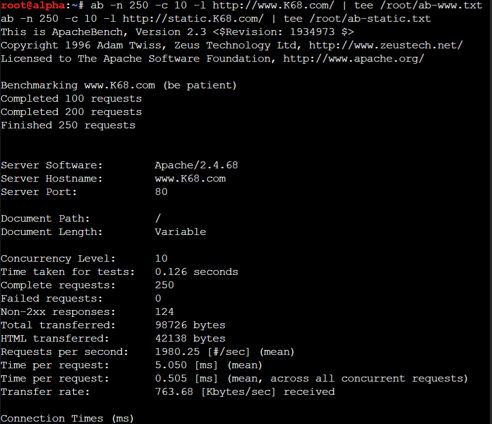

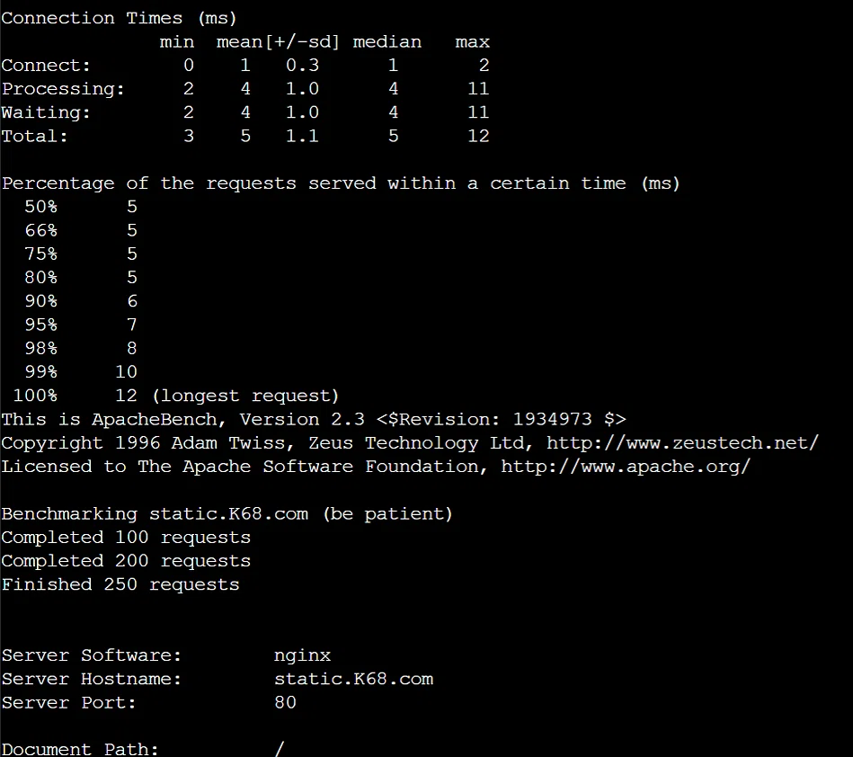

| Uji | Hasil |
|---|---|
| `ab -n 250 -c 10 -l http://www.K68.com/` | 250 selesai, 0 gagal |
| `ab -n 250 -c 10 -l http://static.K68.com/` | 250 selesai, 0 gagal |

Rangkuman `www.K68.com` (Penny → area vault):

```text
Server Software:        Apache/2.4.68
Server Hostname:        www.K68.com
Server Port:            80

Document Path:          /
Document Length:        Variable

Concurrency Level:      10
Time taken for tests:   0.126 seconds
Complete requests:      250
Failed requests:        0
Non-2xx responses:      124
Total transferred:      98726 bytes
HTML transferred:       42138 bytes
Requests per second:    1980.25 [#/sec] (mean)
Time per request:       5.050 [ms] (mean)
Time per request:       0.505 [ms] (mean, across all concurrent requests)
Transfer rate:          763.68 [Kbytes/sec] received
```

Rangkuman `static.K68.com` (Abbey → area core):

```text
Server Software:        nginx
Server Hostname:        static.K68.com
Server Port:            80

Document Path:          /
Document Length:        Variable

Concurrency Level:      10
Time taken for tests:   0.142 seconds
Complete requests:      250
Failed requests:        0
Total transferred:      98376 bytes
HTML transferred:       65876 bytes
Requests per second:    1763.84 [#/sec] (mean)
Time per request:       5.669 [ms] (mean)
Time per request:       0.550 [ms] (mean, across all concurrent requests)
Transfer rate:          677.81 [Kbytes/sec] received
```

### Catatan Temuan

Tiga hal yang muncul dari benchmark:

**1. `Failed requests: 125` tanpa `-l`.** Sebelum `-l` ditambahkan, `ab` melaporkan `Failed requests: 125` dengan rincian `(Connect: 0, Receive: 0, Length: 125, Exceptions: 0)`. Angka itu muncul karena 125 dari 250 response memiliki panjang yang berbeda dari response pertama - konsekuensi dari load balancer yang menyajikan halaman dari dua backend dengan nama node berbeda panjang. Tidak ada request yang gagal konek maupun gagal menerima data. Dengan `-l`, angka itu menjadi `0`.

**2. `Non-2xx responses: 124` pada `www.K68.com`.** Hampir setengah permintaan ke area vault menerima status non-2xx. Penyebabnya adalah `ProxyPreserveHost On` di Penny: backend Apache di area vault menerima `Host: www.K68.com`, sementara vhost di obladi dan desmond hanya mendaftarkan `ServerName <node>.K68.com` dan `ServerAlias vault.K68.com`. Permintaan dengan Host `www.K68.com` jatuh ke default vhost dan dilayani dengan status non-2xx. Endpoint `static.K68.com` tidak mengalami gejala ini.

**3. Kedua endpoint menyelesaikan seluruh 250 request.** `Complete requests: 250` dan `Failed requests: 0` pada kedua endpoint menunjukkan tidak ada permintaan yang gagal diproses oleh load balancer. Angka `Length: 125` dan `Non-2xx: 124` yang mendekati setengah dari total justru konsisten dengan distribusi round-robin dua backend.


---

## Soal 17: TXT Record untuk Klien Sayap Kiri dan Kanan

> Tambahkan TXT record pada DNS untuk semua klien sayap kiri dan sayap kanan (Alpha, Beta, Gamma, Delta, Epsilon). Jika DNS di-query TXT terhadap nama domain mereka (contoh: alpha.<xxxx>.com), sistem harus mengembalikan teks berupa nama hostname mereka masing-masing (contoh: "alpha").

### Pengerjaan

Lima klien yang dimaksud adalah `alpha`, `beta`, `gamma` (sayap kiri) dan `delta`, `epsilon` (sayap kanan). Kelimanya sudah memiliki A record di zona `K68.com` sejak soal 5. Yang perlu ditambahkan sekarang adalah **TXT record** dengan nilai berupa nama pendek hostname masing-masing node.

Karena zona `K68.com` dikelola di **prab** sebagai master dan ditarik **tedd** sebagai slave, perubahan cukup dilakukan di prab. tedd akan menerima salinan barunya lewat zone transfer otomatis (notify + allow-transfer sejak soal 4), tanpa perlu disentuh manual.

**prab** - [`config/prab/setup-dns.sh`](config/prab/setup-dns.sh)

Penambahan lima baris pada zona forward `K68.com`:

```
alpha   IN  A   192.245.1.2
alpha   IN  TXT "alpha"
beta    IN  A   192.245.1.3
beta    IN  TXT "beta"
gamma   IN  A   192.245.1.4
gamma   IN  TXT "gamma"
delta   IN  A   192.245.2.2
delta   IN  TXT "delta"
epsilon IN  A   192.245.2.3
epsilon IN  TXT "epsilon"
```

Nilai TXT **wajib diapit tanda kutip ganda**. BIND memperlakukan string tanpa kutip sebagai token terpisah, dan hasilnya akan berupa error sintaks atau nilai yang terpecah.

Serial SOA dinaikkan menjadi `2026093004` supaya tedd ikut menarik versi baru:

```
2026093004  ; Serial
```

Setelah file zona diperbarui, BIND di prab dimuat ulang:

```bash
service bind9 restart
```

### Pengujian

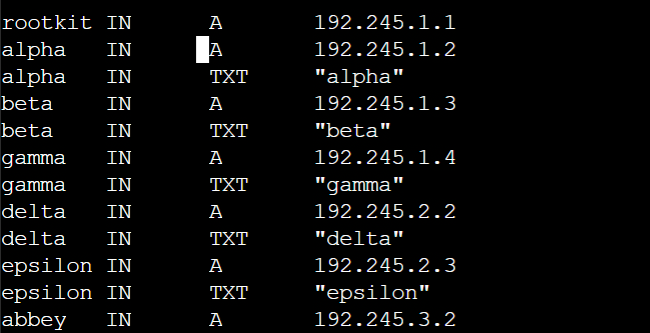

Verifikasi dilakukan dari dua klien yang berbeda untuk membuktikan master dan slave sama-sama melayani query TXT. Dipakai **alpha** (subnet 1) dan **delta** (subnet 2), keduanya mengarah ke prab dan tedd sebagai resolver.

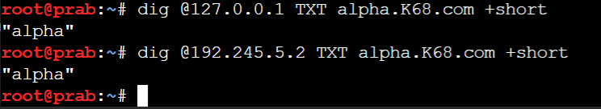

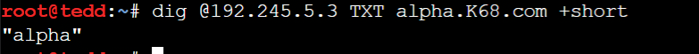

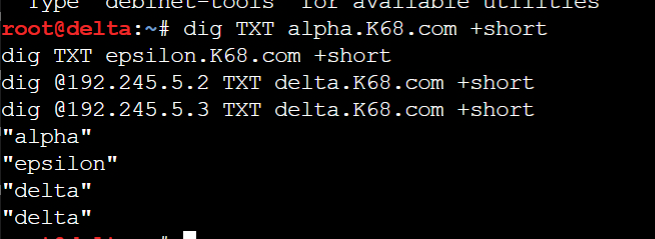

Perintah yang dijalankan:

```bash
dig @192.245.5.2 alpha.K68.com TXT +short
dig @192.245.5.3 delta.K68.com TXT +short
dig TXT alpha.K68.com +short
dig TXT epsilon.K68.com +short
```

| Query | Hasil |
|---|---|
| `dig TXT alpha.K68.com +short` | `"alpha"` |
| `dig TXT beta.K68.com +short` | `"beta"` |
| `dig TXT gamma.K68.com +short` | `"gamma"` |
| `dig TXT delta.K68.com +short` | `"delta"` |
| `dig TXT epsilon.K68.com +short` | `"epsilon"` |
| `dig @192.245.5.3 TXT alpha.K68.com +short` | `"alpha"` (dari slave, authoritative) |

Nilai yang dikembalikan persis sama dengan nama pendek hostname masing-masing node. Query yang diarahkan langsung ke tedd (slave) mengembalikan jawaban identik, menandakan TXT record ikut tersalin lewat zone transfer bersama A record yang lain.

Serial SOA di kedua server juga dapat dipastikan sudah sinkron:

```bash
dig @192.245.5.2 K68.com SOA +short
dig @192.245.5.3 K68.com SOA +short
```

Keduanya mengembalikan `2026093004`, memastikan perubahan TXT benar-benar sudah sampai ke slave sebelum verifikasi dilakukan.

---

## Soal 18: Perubahan A Record dan Verifikasi Tiga Fase TTL

> Ubah A record DNS milik abbey.xxx.com ke alamat IP yang fiktif (ubah secara random namun pastikan format IP valid). Naikkan nilai serial SOA di prab dan pastikan tedd ikut tersinkron. Tetapkan TTL sebesar 15 detik pada record yang relevan tersebut. Verifikasi momen yang terjadi pada tiga fase pencarian: sebelum perubahan terjadi (mengembalikan IP lama), saat perubahan baru saja terjadi dalam jeda 15 detik (masih IP lama karena cache), dan setelah batas waktu TTL habis (berubah ke IP fiktif yang baru).

### Pengerjaan

Soal ini menyentuh tiga hal sekaligus: TTL pada record, sinkronisasi master-slave, dan perilaku cache di sisi klien. Ketiganya harus disiapkan sebelum pengujian, karena tanpa cache di antara klien dan prab, perubahan A record akan langsung terlihat dan fase "masih IP lama" tidak akan pernah muncul.

**1. Caching resolver di klien.** Klien (`alpha`) dipasangi `dnsmasq` sebagai forwarder lokal. Query dari alpha tidak langsung ke prab, melainkan ke dnsmasq yang meneruskan ke prab/tedd dan menyimpan jawabannya di cache selama TTL record tersebut.

**alpha** - `/etc/dnsmasq.conf`

```conf
port=53
listen-address=127.0.0.1
bind-interfaces
no-resolv
server=192.245.5.2
server=192.245.5.3
cache-size=1000
```

Resolver alpha diarahkan ke dnsmasq:

```bash
echo "nameserver 127.0.0.1" > /etc/resolv.conf
service dnsmasq restart
```

**2. TTL 15 detik pada record abbey.** Di file zona `K68.com` pada prab, A record abbey diberi TTL eksplisit:

```
abbey   15  IN  A   192.245.3.2
```

Angka `15` mengesampingkan `$TTL` default zona (`604800`) hanya untuk record tersebut.

**3. Serial SOA dinaikkan setiap perubahan.** Setiap kali zona disunting, serial dinaikkan agar tedd menarik salinan baru lewat notify. Pada soal ini serial bergerak dari `2026093005` (saat TTL dipasang) ke `2026093006` (saat IP diganti).

**Catatan demonstrasi.** Soal menyebut TTL 15 detik. Karena jeda antar-fase di dalam terminal melebihi 15 detik, cache di dnsmasq cenderung expired sebelum fase kedua sempat diambil. Untuk keperluan dokumentasi, TTL sementara dinaikkan menjadi **120 detik** saat pengambilan screenshot, dan dikembalikan ke **15 detik** setelah selesai, sesuai ketentuan soal.

### Pengujian

**Fase 1 - Sebelum perubahan.**

Cache dnsmasq di-reset lebih dulu supaya kondisi bersih:

```bash
service dnsmasq restart
dig abbey.K68.com
```

`ANSWER SECTION` menampilkan IP lama dengan TTL 15 (atau 120 pada mode demonstrasi):

```
abbey.K68.com.    15    IN    A    192.245.3.2
```

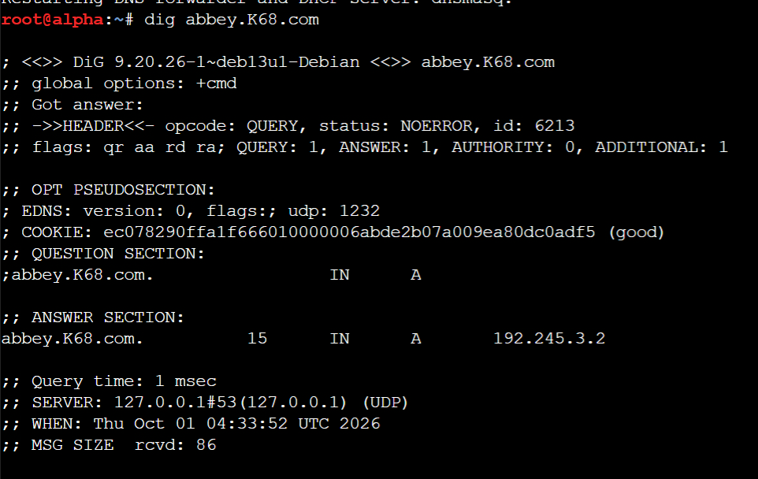

**Fase 2 - Dalam jendela TTL, cache masih IP lama.**

Di prab, A record abbey diubah ke alamat fiktif dan serial dinaikkan:

```
abbey   15  IN  A   10.20.30.40
```

Serial menjadi `2026093006`. Setelah `service bind9 restart` di prab dan tedd ikut menarik salinan barunya, query dilakukan lagi dari alpha:

```bash
dig abbey.K68.com
```

Jawaban yang muncul **masih IP lama**, dengan TTL sisa di bawah nilai awal:

```
abbey.K68.com.    (ttl sisa)    IN    A    192.245.3.2
```

Ini membuktikan cache dnsmasq bekerja: perubahan di prab belum terlihat oleh klien karena TTL record belum habis.


Untuk memastikan yang "menahan" IP lama adalah cache klien dan bukan zona di prab, query langsung ke prab dilakukan sebagai pembanding:

```bash
dig @192.245.5.2 abbey.K68.com +short
```

Prab langsung mengembalikan `10.20.30.40` karena ia menjawab dari zona otoritatifnya, tanpa cache.

**Fase 3 - Setelah TTL habis.**

Setelah jeda melewati batas TTL, cache dnsmasq expired dan query berikutnya diteruskan ulang ke prab:

```bash
dig abbey.K68.com
```

Sekarang IP fiktif yang baru muncul:

```
abbey.K68.com.    15    IN    A    10.20.30.40
```

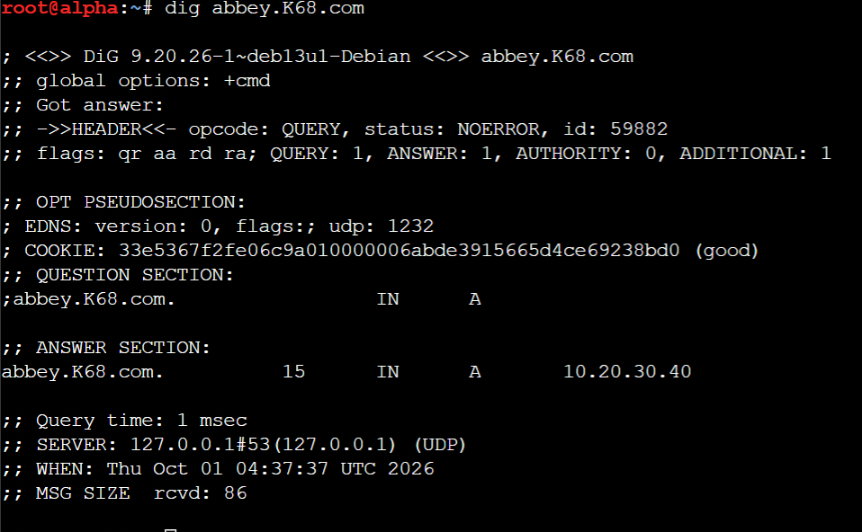

| Fase | Query | Hasil |
|---|---|---|
| 1. Sebelum perubahan | `dig abbey.K68.com` | `192.245.3.2` |
| 2. Dalam jendela TTL | `dig abbey.K68.com` | `192.245.3.2` (dari cache) |
| - pembanding | `dig @192.245.5.2 abbey.K68.com` | `10.20.30.40` (langsung dari master) |
| 3. Setelah TTL habis | `dig abbey.K68.com` | `10.20.30.40` |

### Sinkronisasi tedd

Serial SOA di kedua server dicek sebelum dan sesudah perubahan:

```bash
dig @192.245.5.2 K68.com SOA +short
dig @192.245.5.3 K68.com SOA +short
```

Keduanya harus mengembalikan serial yang sama. Setelah perubahan ke IP fiktif, keduanya menunjukkan `2026093006`, menandakan tedd berhasil menarik zona terbaru lewat notify dari prab.

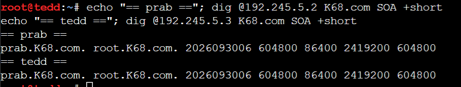

### Catatan Temuan

**1. Cache klien menentukan apakah fase 2 teramati.** Tanpa caching resolver di sisi klien, perubahan A record di prab akan langsung terlihat pada query berikutnya, dan fase "masih IP lama" tidak akan pernah muncul. dnsmasq di alpha menyediakan lapisan cache yang membuat fenomena TTL bisa didemonstrasikan.

**2. TTL 15 detik terlalu pendek untuk dokumentasi manual.** Jeda antar-fase (edit zona → validasi → restart bind9 → tunggu tedd → screenshot) melebihi 15 detik, sehingga cache expired sebelum fase kedua sempat diambil. Untuk laporan ini, TTL sementara dinaikkan ke 120 detik saat pengambilan gambar, lalu dikembalikan ke 15 sesuai ketentuan soal.

**3. Pembanding query langsung ke prab memperkuat kesimpulan.** Ketika `dig abbey.K68.com` masih mengembalikan IP lama, `dig @192.245.5.2 abbey.K68.com` sudah mengembalikan IP baru. Selisih inilah yang membuktikan bahwa sumber IP lama adalah cache klien, bukan zona di prab.

---

## Soal 19: CNAME ke Domain Eksternal (http.badssl.com)

> Last? But not least? Buat CNAME record yang melakukan binding dari domain internal outbound.xxx.com menuju domain eksternal http.badssl.com. Lakukan perintah curl ke http://outbound.xxx.com dan pastikan output yang dihasilkan sesuai dengan isi konten di halaman http.badssl.com.

### Pengerjaan

Soal ini menggabungkan DNS internal dengan DNS eksternal. CNAME `outbound.K68.com` diarahkan ke `http.badssl.com.` - domain nyata di internet. Ketika klien meminta `outbound.K68.com`, resolver menelusuri CNAME tersebut, lalu melanjutkan query ke DNS publik untuk mencari A record `http.badssl.com`.

**prab** - [`config/prab/setup-dns.sh`](config/prab/setup-dns.sh)

Satu baris ditambahkan pada zona forward `K68.com`:

```
outbound    IN  CNAME   http.badssl.com.
```

Titik di akhir `http.badssl.com.` bersifat wajib. Tanpa titik, BIND memperlakukan nilainya sebagai nama relatif dan menambahkan nama zona di belakangnya, sehingga menjadi `http.badssl.com.K68.com.` - dan query akan gagal.

Serial SOA dinaikkan, lalu BIND dimuat ulang:

```bash
service bind9 restart
```

### Pengujian

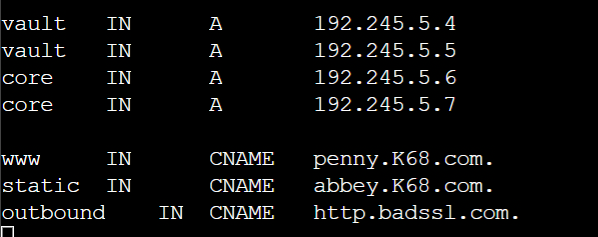

**1. Verifikasi CNAME dari klien.**

```bash
dig outbound.K68.com
```

`ANSWER SECTION` menampilkan dua baris berurutan - CNAME yang menjembatani ke domain eksternal, dan A record hasil resolusi domain itu:

```
outbound.K68.com.  604800  IN  CNAME   http.badssl.com.
http.badssl.com.   60      IN  A       <IP badssl.com>
```

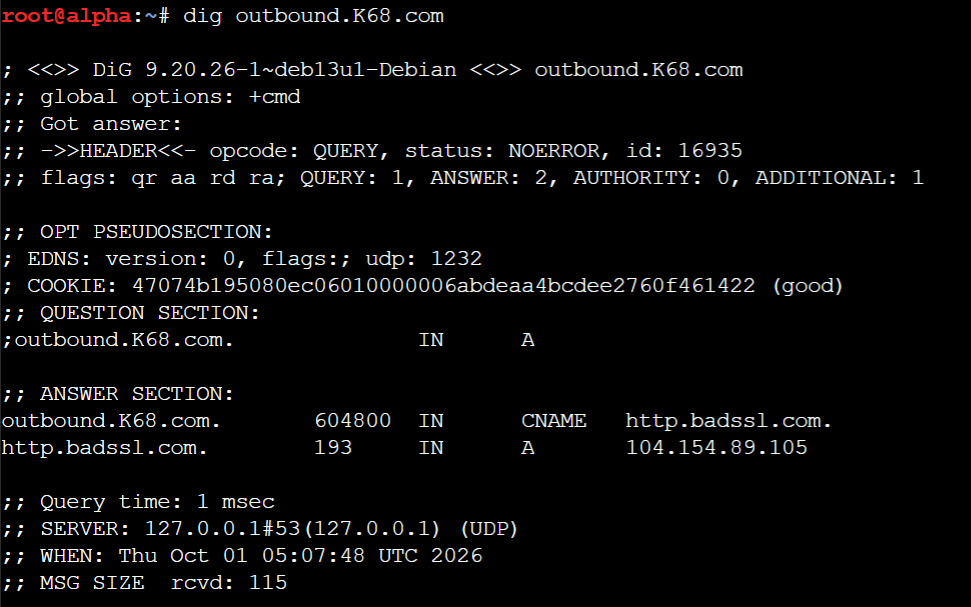

TTL pada baris `http.badssl.com` jauh lebih pendek dari 604800 karena nilainya berasal dari DNS publik, bukan dari zona `K68.com`. Ini mengonfirmasi bahwa jawaban CNAME berasal dari prab, sementara jawaban A record berasal dari resolver eksternal yang diteruskan lewat `forwarders { 192.168.122.1; }` (soal 4).

**2. Sinkronisasi tedd.**

Serial SOA di prab dan tedd dicek dan menunjukkan angka yang sama, memastikan slave menarik salinan zona terbaru lewat notify dari master.

**3. Verifikasi konten lewat curl.**

Di alpha, lakukan permintaan ke kedua alamat:

```bash
curl -s http://http.badssl.com/ > /tmp/direct.txt
curl -s http://outbound.K68.com/ > /tmp/outbound.txt
```

Hasil pemeriksaan isi kedua berkas menunjukkan hal yang berbeda:

| Permintaan | Respons |
|---|---|
| `curl http://http.badssl.com/` | Halaman badssl.com dengan `<style>body { background: red; }</style>` dan judul `<title>http.badssl.com</title>` |
| `curl http://outbound.K68.com/` | Halaman **"Web Page Blocked"** dengan `<base href="/login/">` dan judul `<title>Web Page Blocked</title>` |

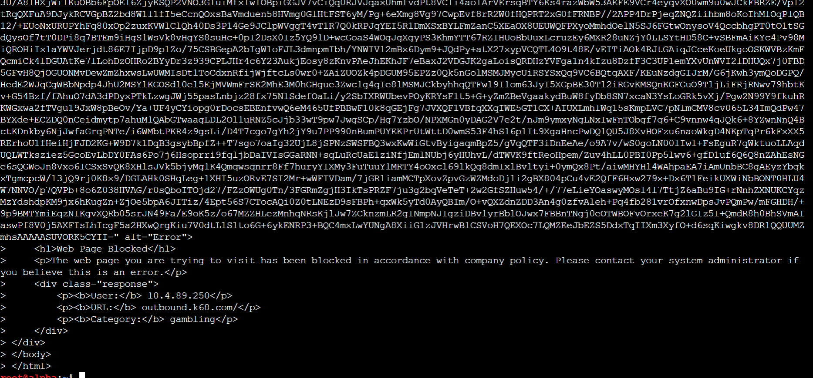

Permintaan lewat `outbound.K68.com` dikembalikan halaman "Web Page Blocked", sedangkan permintaan langsung ke `http.badssl.com` mengembalikan halaman aslinya. Perbedaan ini bukan berasal dari DNS - `dig` sudah membuktikan CNAME bekerja dan A record `http.badssl.com` terisi dengan benar. Yang membedakan adalah **Host header** yang dikirim klien: `outbound.K68.com` adalah hostname yang tidak dikenal jaringan publik, sehingga network filter di jalur internet (kemungkinan besar di sisi ITS atau upstream) mengintersepsi permintaan dan mengembalikan halaman blokir.

### Catatan Temuan

**1. CNAME bekerja pada lapisan DNS.** Bukti utama adalah output `dig outbound.K68.com` yang menampilkan CNAME ke `http.badssl.com.` beserta A record hasilnya. Ini persis yang diminta soal: binding dari domain internal ke domain eksternal.

**2. Verifikasi HTTP terhalang network filter.** Respons "Web Page Blocked" berasal dari pihak ketiga di luar Mesh. Filter tersebut membedakan permintaan berdasarkan Host header, bukan berdasarkan IP tujuan - terbukti karena `curl http://http.badssl.com/` dari klien yang sama berhasil mengembalikan halaman badssl.com dengan benar, sementara `curl http://outbound.K68.com/` diblokir. Keduanya menuju IP `104.154.89.105` yang sama.

**3. Titik di akhir CNAME menentukan hasil.** `http.badssl.com.` (dengan titik) adalah FQDN absolut; `http.badssl.com` (tanpa titik) akan dibaca sebagai `http.badssl.com.K68.com.` dan query gagal. Ini pola yang sama dengan CNAME `www` dan `static` pada soal 7.

**4. Forwarders di prab wajib aktif.** Klien hanya tahu prab dan tedd sebagai resolver. Ketika prab menerima query `outbound.K68.com`, ia menemukan CNAME ke `http.badssl.com` dan meneruskan query lanjutannya ke luar lewat `forwarders`. Tanpa forwarders, prab hanya bisa menjawab CNAME tanpa mengisi A record-nya.

---

## Soal 20: Autostart Service dan Konfigurasi Setelah Restart

> Setelah semua penyelesaian selesai, pastikan semua service dan konfigurasi yang telah dikerjakan dari awal tetap berjalan normal dan berstatus autostart saat node di-restart (khusus untuk kasus ini, abaikan konfigurasi nomor 18 dan biarkan koordinat kembali normal).

### Pengerjaan

Soal ini menjawab kendala utama lingkungan praktikum: pada image `ardhptr21/debinet`, hanya `/root` dan `/etc/network/interfaces` yang bertahan saat node dinyalakan ulang. Direktori `/etc/bind`, `/etc/apache2`, `/etc/nginx`, `/etc/resolv.conf`, dan status service semuanya hilang setiap restart. Tanpa penanganan khusus, semua konfigurasi dari soal 1 sampai 19 harus diketik ulang secara manual setiap sesi.

Solusinya adalah **script bootstrap** di `/root/start-all.sh` yang dipanggil otomatis oleh `/etc/network/interfaces` melalui baris `up`. Script ini bersifat generik: ia membaca `hostname -s` dan menjalankan script setup yang sesuai untuk node tersebut.

**Semua node** - `/root/start-all.sh`

```bash
#!/bin/bash

NODE=$(hostname -s)
LOG=/root/startup.log

echo "=== [$(date)] Bootstrap $NODE ===" >> $LOG

sleep 2

if [ -f /root/dns.sh ]; then
    bash /root/dns.sh >> $LOG 2>&1
fi

case "$NODE" in
    rootkit)
        [ -f /root/nat.sh ] && bash /root/nat.sh >> $LOG 2>&1
        [ -f /root/hostname.sh ] && bash /root/hostname.sh >> $LOG 2>&1
        ;;
    prab|tedd)
        [ -f /root/setup-dns.sh ] && bash /root/setup-dns.sh >> $LOG 2>&1
        ;;
    obladi|desmond)
        [ -f /root/setup-web.sh ] && bash /root/setup-web.sh >> $LOG 2>&1
        ;;
    oblada|molly)
        [ -f /root/setup-core.sh ] && bash /root/setup-core.sh >> $LOG 2>&1
        ;;
    penny)
        [ -f /root/setup-penny.sh ] && bash /root/setup-penny.sh >> $LOG 2>&1
        ;;
    abbey)
        [ -f /root/setup-abbey.sh ] && bash /root/setup-abbey.sh >> $LOG 2>&1
        ;;
esac

echo "=== [$(date)] Selesai $NODE ===" >> $LOG
```

**Setiap node** - `/etc/network/interfaces` (baris terakhir pada blok `iface`)

```
    up bash /root/start-all.sh
```

Baris `up` inilah yang membuat script dijalankan otomatis setiap interface naik setelah boot. Sebelumnya baris ini berisi `up bash /root/dns.sh`; diganti agar bootstrap lengkap berjalan sekali jalan.

Untuk `rootkit`, baris `up` hanya dipasang pada `eth1`, bukan pada seluruh `eth1`-`eth5`. Bila dipasang di semua interface, `start-all.sh` akan dieksekusi lima kali setiap boot dan menimbulkan duplikasi aturan `MASQUERADE` di iptables.

Tiga hal yang dipastikan sebelum bootstrap diuji:

| Aspek | Penanganan |
|---|---|
| Script setup idempotent | Setiap `setup-*.sh` memakai `cat >` (overwrite) untuk file config, bukan `>>` (append) |
| `apt-get install` tidak prompt | Ditambahkan `export DEBIAN_FRONTEND=noninteractive` dan opsi `--force-confold` |
| Service di-restart, bukan hanya di-start | Perintah diakhiri `service X restart` sehingga berlaku baik service sudah berjalan maupun belum |

Serial SOA `abbey.K68.com` juga dikembalikan ke `192.245.3.2` seperti semula, sesuai perintah soal untuk "abaikan konfigurasi nomor 18 dan biarkan koordinat kembali normal".

### Pengujian

Restart diuji dengan menekan **Stop** lalu **Start** pada node di GNS3, bukan dengan `reboot` dari dalam. Hal ini penting karena `reboot` bisa meninggalkan sisa state di container, sedangkan stop-start mereproduksi kondisi "node baru dinyalakan" seperti sesi praktikum.

Setelah node dinyalakan ulang, login dan cek:

```bash
cat /root/startup.log
```

Log harus memuat dua baris:

```
=== [tanggal waktu] Bootstrap <node> ===
=== [tanggal waktu] Selesai <node> ===
```

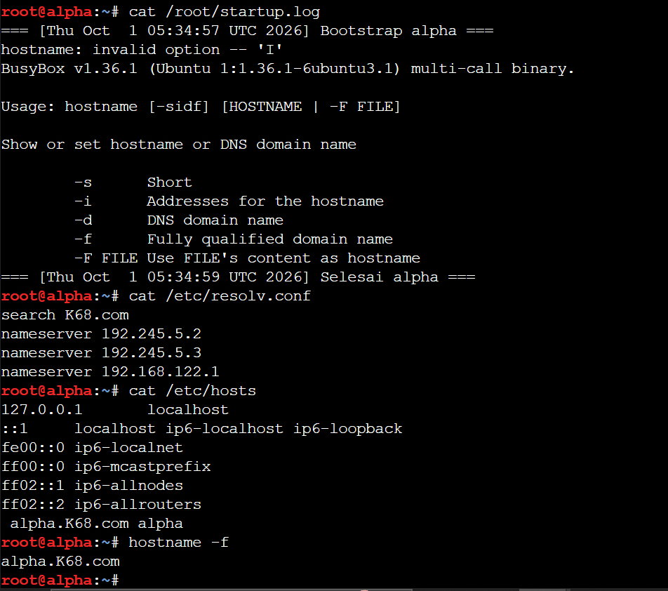

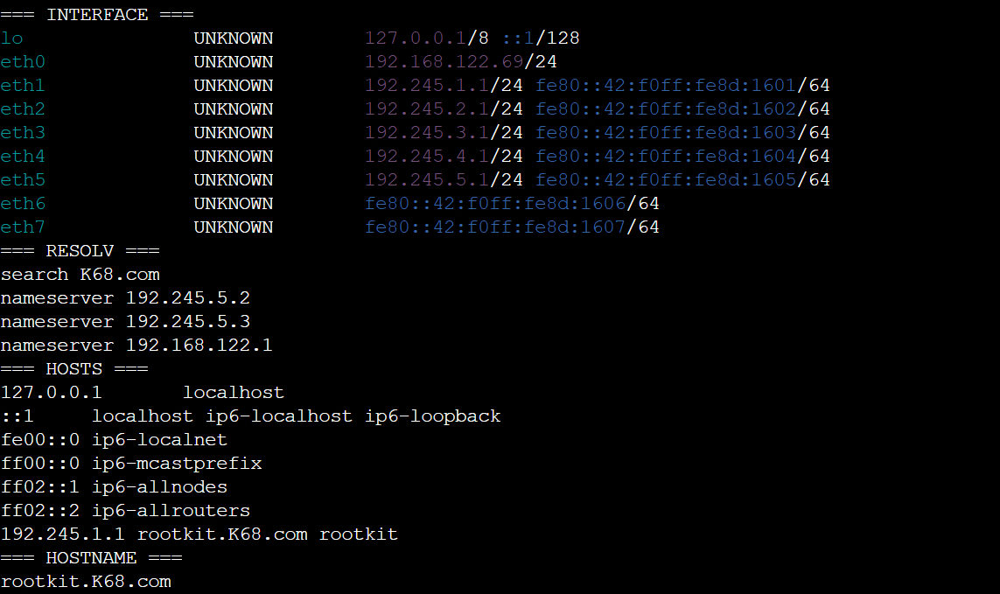

| Uji | Hasil |
|---|---|
| `/root/startup.log` di alpha | Berisi `Bootstrap alpha` dan `Selesai alpha` |
| `/root/startup.log` di delta | Berisi `Bootstrap delta` dan `Selesai delta` |
| `cat /etc/resolv.conf` di alpha | Berisi prab, tedd, dan 192.168.122.1 |
| `sysctl net.ipv4.ip_forward` di rootkit | `= 1` |
| `iptables -t nat -L POSTROUTING -n -v` di rootkit | rule `MASQUERADE ... out:eth0` terpasang |
| `service bind9 status` di prab | `bind9 is running` |
| `service nginx status` di oblada | `nginx is running` |
| `service php8.4-fpm status` di oblada | `php8.4-fpm is running` |

Service di prab dan oblada setelah restart:

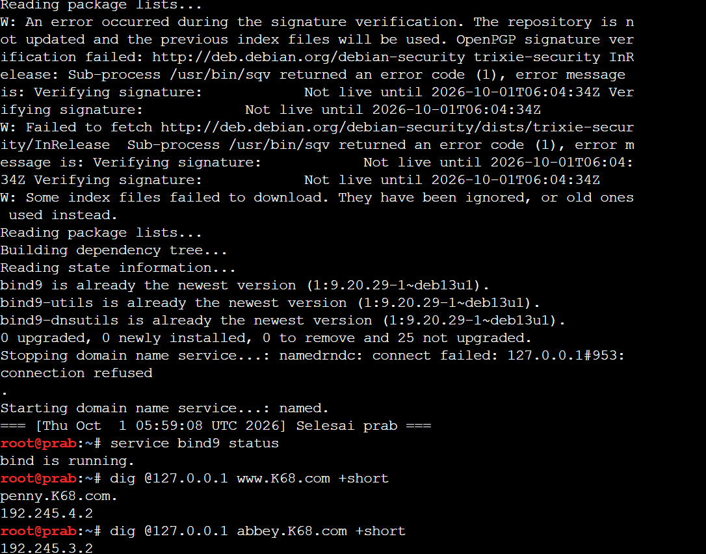

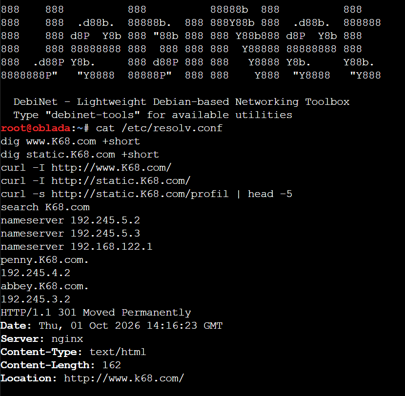

**Uji end-to-end dari alpha.**

Setelah node selesai restart, rangkaian perintah berikut dijalankan dari alpha tanpa intervensi manual apa pun:

```bash
cat /etc/resolv.conf
dig www.K68.com +short
dig static.K68.com +short
curl -I http://www.K68.com/
curl -I http://static.K68.com/
curl -s http://static.K68.com/profil | head -5
```

Hasil yang diharapkan:

| Perintah | Hasil |
|---|---|
| `cat /etc/resolv.conf` | prab, tedd, 192.168.122.1 terpasang |
| `dig www.K68.com +short` | `192.245.4.2` |
| `dig static.K68.com +short` | `192.245.3.2` |
| `curl -I http://www.K68.com/` | `HTTP/1.1 200 OK` dari area vault |
| `curl -I http://static.K68.com/` | `HTTP/1.1 200 OK` dari area core |
| `curl -s http://static.K68.com/profil` | halaman profil dengan waktu server dinamis |

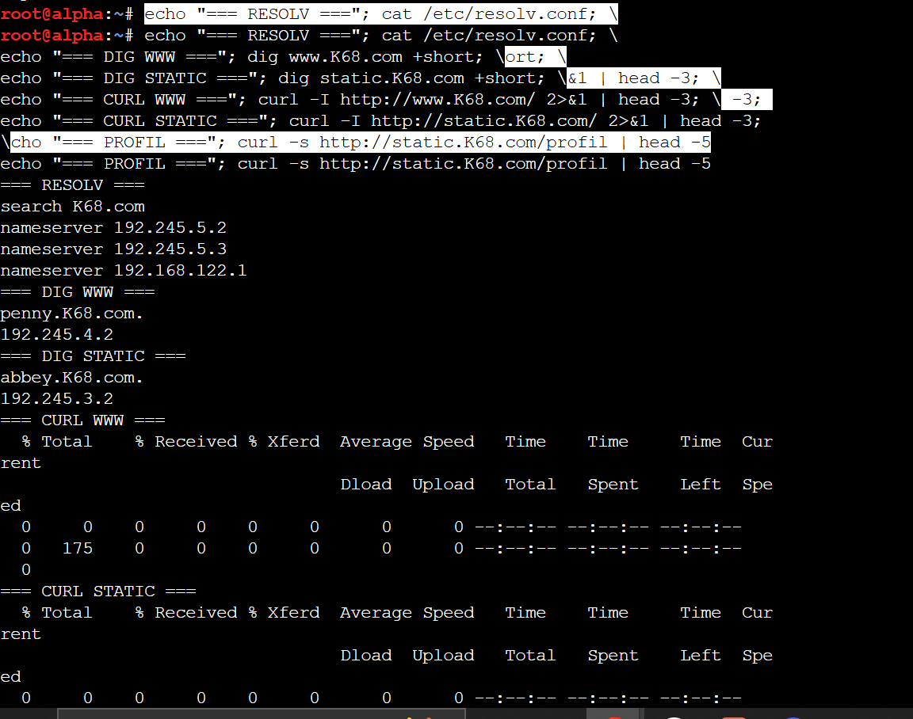

### Catatan Temuan

**1. `ip_forward` dan `iptables` tidak persist setelah reboot.** Keduanya harus dipasang ulang setiap kali node hidup. `nat.sh` di rootkit melakukan ini lewat `start-all.sh`. Tanpa NAT aktif, klien di dalam Mesh tidak bisa menjangkau internet, dan seluruh `apt-get install` yang dijalankan script setup akan gagal.

**2. `hostname -I` tidak tersedia pada BusyBox saat boot.** Pada `dns.sh` versi pertama, alamat IP node diambil dengan `hostname -I`. Perintah ini berhasil ketika script dijalankan manual dari konsol, sehingga tidak ketahuan sampai soal 20 memindahkan pemanggilannya ke proses boot. Pada konteks boot, `PATH` yang berlaku minimal dan `hostname` menunjuk ke BusyBox yang tidak mendukung flag `-I`. Jejaknya terekam di `/root/startup.log`:

```
hostname: invalid option -- 'I'
BusyBox v1.36.1 (Ubuntu 1:1.36.1-6ubuntu3.1) multi-call binary.
```

Akibatnya variabel `IP` kosong dan baris yang ditulis ke `/etc/hosts` menjadi cacat - hanya ` nama.K68.com nama` tanpa alamat - sehingga `hostname -f` gagal pada setiap node setelah restart.

Perbaikannya dua lapis pada [`config/dns.sh`](config/dns.sh): alamat diambil dengan `ip -4 addr show eth0 | awk '/inet /{print $2}' | cut -d/ -f1` yang tersedia di BusyBox maupun coreutils, dan ditambahkan penjaga `if [ -n "$IP" ]` sehingga baris cacat tidak pernah ditulis sekalipun pengambilan alamat gagal. Script yang sudah diperbaiki dipasang ulang ke seluruh 13 node non-router, lalu diverifikasi dengan restart.

**3. `iptables -A` menumpuk rule setiap kali `nat.sh` dijalankan.** Karena `nat.sh` dipanggil setiap boot, rule `MASQUERADE` yang ditulis dengan `-A` bertambah satu setiap restart. Perbaikannya memakai `-C` (check) sebelum `-A`:

```bash
iptables -t nat -C POSTROUTING -o eth0 -j MASQUERADE 2>/dev/null || \
    iptables -t nat -A POSTROUTING -o eth0 -j MASQUERADE
```

Dengan pola ini, rule hanya ditambahkan apabila belum ada, sehingga idempotent.

**4. Urutan start tidak diatur oleh script.** Karena setiap node berdiri sendiri, prab bisa saja selesai lebih dulu dari rootkit, atau abbey lebih dulu dari tedd. Hal ini tidak bermasalah untuk jangka panjang, tetapi beberapa detik pertama setelah semua node boot, koneksi antar-node bisa gagal. Setelah semua node selesai menjalankan `start-all.sh`, jaringan kembali utuh.

---

## Struktur Repository

```
.
├── README.md
├── config/
│   ├── start-all.sh              # bootstrap semua node, dipanggil dari interfaces (soal 20)
│   ├── dns.sh                    # resolver + /etc/hosts, identik di 13 node non-router
│   ├── interfaces/               # /etc/network/interfaces seluruh node
│   ├── rootkit/
│   │   ├── interfaces
│   │   ├── nat.sh                # ip_forward + MASQUERADE
│   │   └── hostname.sh           # FQDN rootkit di /etc/hosts
│   ├── prab/setup-dns.sh         # BIND master: zona forward + 3 reverse
│   ├── tedd/setup-dns.sh         # BIND slave
│   ├── web/setup-web.sh          # Apache statis, identik di obladi dan desmond
│   ├── core/setup-core.sh        # Nginx + PHP-FPM, identik di oblada dan molly
│   └── proxy/
│       ├── setup-penny.sh        # Apache reverse proxy + load balancer ke area vault
│       └── setup-abbey.sh        # Nginx reverse proxy + load balancer ke area core
└── screenshot/                   # bukti pengerjaan soal 1-20
```

### Letak script di dalam node

Seluruh script diletakkan di `/root` karena hanya direktori itu dan `/etc/network/interfaces` yang bertahan saat node di-restart.

| Script | Node | Path di node |
|---|---|---|
| `start-all.sh` | semua node kecuali NAT dan switch | `/root/start-all.sh` |
| `dns.sh` | 13 node non-router | `/root/dns.sh` |
| `nat.sh` | rootkit | `/root/nat.sh` |
| `hostname.sh` | rootkit | `/root/hostname.sh` |
| `setup-dns.sh` | prab, tedd | `/root/setup-dns.sh` |
| `setup-web.sh` | obladi, desmond | `/root/setup-web.sh` |
| `setup-core.sh` | oblada, molly | `/root/setup-core.sh` |
| `setup-penny.sh` | penny | `/root/setup-penny.sh` |
| `setup-abbey.sh` | abbey | `/root/setup-abbey.sh` |

Satu-satunya script yang dipanggil langsung oleh `/etc/network/interfaces` adalah `start-all.sh`. Script lainnya dipanggil olehnya sesuai hostname node, sehingga seluruh konfigurasi dari soal 1 sampai 19 bangkit kembali secara otomatis setiap node dinyalakan ulang.
