# Jarkom Modul 2 Shadow Net Operation

**Kelompok K-68 (Group C) Praktikum Komunikasi Data dan Jaringan Komputer 2026**

| | |
|---|---|
| Domain | `K68.com` |
| Prefix IP | `192.245.0.0/16` |
| Image | `ardhptr21/debinet:latest` |
| Controller | GNS3 remote, Group C |

## Anggota dan Pembagian

| Nama | NRP | Soal |
|---|---|---|
| Ryan Adya Purwanto | 5027231046 | 1 – 9 |
| Made Gde Krisna Wangsa | 5027201047 | 10 – 20 |

Laporan ini mencakup **soal 1 sampai 15**.

---

## Daftar Isi

- [Topologi](#topologi)
- [Pembagian IP](#pembagian-ip)
- [Catatan Teknis Penting](#catatan-teknis-penting)
- [Soal 1 — Topologi dan Pengalamatan IP](#soal-1--topologi-dan-pengalamatan-ip)
- [Soal 2 — WAN dan NAT](#soal-2--wan-dan-nat)
- [Soal 3 — Routing Internal dan Resolver Awal](#soal-3--routing-internal-dan-resolver-awal)
- [Soal 4 — Zona DNS Master dan Slave](#soal-4--zona-dns-master-dan-slave)
- [Soal 5 — Hostname dan Domain per Node](#soal-5--hostname-dan-domain-per-node)
- [Soal 6 — Verifikasi Zone Transfer](#soal-6--verifikasi-zone-transfer)
- [Soal 7 — Record vault, core, dan CNAME](#soal-7--record-vault-core-dan-cname)
- [Soal 8 — Reverse Zone dan PTR](#soal-8--reverse-zone-dan-ptr)
- [Soal 9 — Web Statis dan Autoindex](#soal-9--web-statis-dan-autoindex)
- [Soal 10 — Web Dinamis dan Rewrite URL](#soal-10--Web-Dinamis-dan-Rewrite-URL)
- [Soal 11 — Reverse Proxy dan Load Balancer](#soal-11--Reverse-Proxy-dan-Load-Balancer)
- [Soal 12 — Basic Authentication (Penny)](#soal-12--Basic-Authentication-(Penny))
- [Soal 13 — Redirection (Penny & Abbey)](#soal-13--Redirection-(Penny-&-Abbey))
- [Soal 14 — Forwarding Real IP ke Access Log Backend](#soal-14--Forwarding-Real-IP-ke-Access-Log-Backend)
- [Soal 15 — Jalur Proxy Khusus (Standalone)](#soal-15--Jalur-Proxy-Khusus-(Standalone))
- [Struktur Repository](#struktur-repository)

---

## Topologi

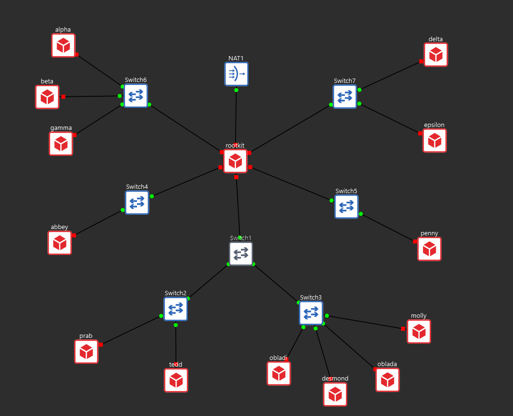

Tujuh switch, lima di antaranya tersambung langsung ke router `rootkit`:

```
rootkit --+-- eth1 -- Switch6 -- alpha, beta, gamma
          +-- eth2 -- Switch7 -- delta, epsilon
          +-- eth3 -- Switch4 -- abbey
          +-- eth4 -- Switch5 -- penny
          +-- eth5 -- Switch1 --+-- Switch2 -- prab, tedd
                                +-- Switch3 -- obladi, desmond, oblada, molly
eth0 -- NAT1 (DHCP)
```

Switch2 dan Switch3 tidak tersambung ke rootkit melainkan ke Switch1. Karena switch bekerja di layer 2 dan tidak memisahkan jaringan, ketiganya membentuk **satu broadcast domain**, sehingga prab, tedd, obladi, desmond, oblada, dan molly berada dalam **satu subnet** dan dilayani oleh satu interface router saja (`eth5`).

## Pembagian IP

| Interface rootkit | Switch | Subnet | Node |
|---|---|---|---|
| eth1 | Switch6 | 192.245.1.0/24 | alpha, beta, gamma |
| eth2 | Switch7 | 192.245.2.0/24 | delta, epsilon |
| eth3 | Switch4 | 192.245.3.0/24 | abbey |
| eth4 | Switch5 | 192.245.4.0/24 | penny |
| eth5 | Switch1+2+3 | 192.245.5.0/24 | prab, tedd, obladi, desmond, oblada, molly |

| Node | IP | Gateway |
|---|---|---|
| rootkit eth1 | 192.245.1.1 | — |
| rootkit eth2 | 192.245.2.1 | — |
| rootkit eth3 | 192.245.3.1 | — |
| rootkit eth4 | 192.245.4.1 | — |
| rootkit eth5 | 192.245.5.1 | — |
| alpha | 192.245.1.2 | 192.245.1.1 |
| beta | 192.245.1.3 | 192.245.1.1 |
| gamma | 192.245.1.4 | 192.245.1.1 |
| delta | 192.245.2.2 | 192.245.2.1 |
| epsilon | 192.245.2.3 | 192.245.2.1 |
| abbey | 192.245.3.2 | 192.245.3.1 |
| penny | 192.245.4.2 | 192.245.4.1 |
| prab | 192.245.5.2 | 192.245.5.1 |
| tedd | 192.245.5.3 | 192.245.5.1 |
| obladi | 192.245.5.4 | 192.245.5.1 |
| desmond | 192.245.5.5 | 192.245.5.1 |
| oblada | 192.245.5.6 | 192.245.5.1 |
| molly | 192.245.5.7 | 192.245.5.1 |

`eth0` rootkit memakai DHCP dari NAT dan memperoleh `192.168.122.69/24`.

---

## Catatan Teknis Penting

Tiga kendala lingkungan yang menentukan cara seluruh konfigurasi ditulis.

**1. Hanya `/root` dan `/etc/network/interfaces` yang bertahan saat node restart.**
Node Docker kembali ke kondisi image setiap kali dinyalakan ulang. Akibatnya `/etc/bind`, `/etc/apache2`, dan `/etc/resolv.conf` akan hilang. Karena itu seluruh konfigurasi tidak diketik langsung ke lokasi aslinya, melainkan ditulis oleh **script yang disimpan di `/root`**, lalu script itu dipanggil dari `/etc/network/interfaces` melalui baris `up`. Pendekatan ini sekaligus memenuhi aturan praktikum yang mewajibkan script instalasi dan konfigurasi diletakkan di `/root`.

**2. Editor "Edit network configuration" GNS3 membuang baris yang mengandung karakter `>`.**
Karena itu perintah pengalihan output tidak boleh ditulis langsung di `interfaces`. Solusinya, perintah tersebut disembunyikan di dalam file script (`dns.sh`, `nat.sh`), dan `interfaces` hanya memanggilnya dengan `up bash /root/dns.sh`.

**3. Jumlah adapter dinaikkan per node, bukan lewat template global.**
`rootkit` memerlukan enam interface (`eth0`–`eth5`), sementara template default hanya menyediakan lebih sedikit. Karena praktikum berjalan di **remote controller yang dipakai bersama seluruh kelompok**, mengubah template global akan berdampak ke kelompok lain. Perubahan dilakukan lewat klik kanan node → Configure → Network → Adapters = 8, hanya pada `rootkit`.

---

## Soal 1 — Topologi dan Pengalamatan IP

> Tetapkan alamat IP dan default gateway untuk seluruh Entitas sesuai dengan topologi pembagian switch yang dirancang.

### Pengerjaan

Empat belas node DebiNet, tujuh Ethernet switch, dan satu node NAT disusun sesuai gambar topologi. Adapter `rootkit` dinaikkan menjadi 8 agar `eth0`–`eth5` tersedia.

Urutan penyambungan kabel di sisi `rootkit` dijaga berurutan dari `eth0`, karena nama interface di dalam node ditentukan oleh nomor slot adapter di GNS3. Kabel yang tertukar menghasilkan konfigurasi yang benar secara sintaks tetapi terpasang di jaringan yang salah.

Konfigurasi ditulis melalui klik kanan node → **Edit network configuration** (node dalam keadaan mati), yang mengedit `/etc/network/interfaces`.

**rootkit** — [`config/rootkit/interfaces`](config/rootkit/interfaces)

```
auto eth0
iface eth0 inet dhcp

auto eth1
iface eth1 inet static
	address 192.245.1.1
	netmask 255.255.255.0

... eth2 sampai eth5 dengan pola yang sama
```

Interface `eth1`–`eth5` sengaja **tidak diberi baris `gateway`**. Default gateway hanya boleh ada satu per host, dan bagi router jalur keluarnya adalah `eth0` yang sudah memperolehnya otomatis dari DHCP NAT. Menambahkan gateway di interface LAN akan membuat router mengarahkan trafik keluar ke jaringan internalnya sendiri.

**Node lain** — [`config/interfaces/`](config/interfaces/)

```
auto eth0
iface eth0 inet static
	address 192.245.1.2
	netmask 255.255.255.0
	gateway 192.245.1.1
```

### Pengujian

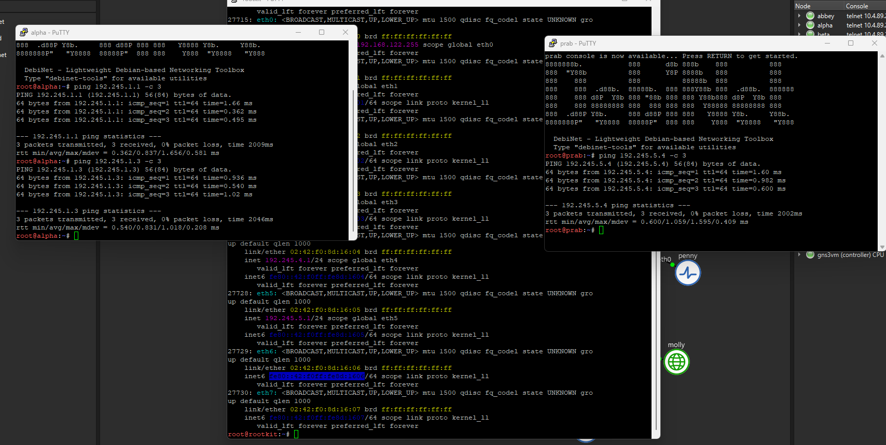

| Uji | Hasil |
|---|---|
| `ip a` di rootkit | eth1–eth5 memegang IP sesuai rancangan |
| alpha → 192.245.1.1 | berhasil, gateway terjangkau |
| alpha → beta | berhasil, komunikasi sesubnet |
| prab → obladi | berhasil, membuktikan cascade Switch1–2–3 benar-benar satu subnet |

---

## Soal 2 — WAN dan NAT

> Pastikan antarmuka WAN di router rootkit aktif. Konfigurasikan NAT agar dapat meneruskan lalu lintas keluar bagi seluruh alamat internal.

### Pengerjaan

Node internal memakai alamat `192.245.x.x` yang tidak dikenal internet. Router harus menyamarkan alamat asal paket dengan alamat `eth0` miliknya sendiri — inilah yang dilakukan target `MASQUERADE`.

**rootkit** — [`config/rootkit/nat.sh`](config/rootkit/nat.sh)

```bash
#!/bin/bash
sysctl -w net.ipv4.ip_forward=1
iptables -t nat -A POSTROUTING -o eth0 -j MASQUERADE
```

`ip_forward` mengizinkan kernel meneruskan paket antar interface. Tanpa ini node hanya bisa berbicara dengan tetangga sesubnet.

`MASQUERADE` dipilih daripada `SNAT` karena alamat `eth0` diperoleh lewat DHCP dan bisa berubah. `MASQUERADE` membaca alamat interface secara dinamis, sedangkan `SNAT` memerlukan alamat yang ditulis tetap.

### Pengujian

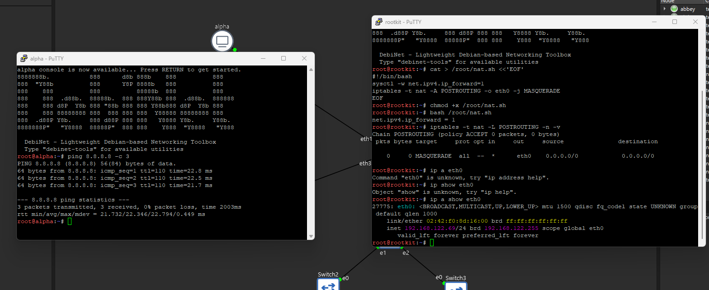

| Uji | Hasil |
|---|---|
| `iptables -t nat -L POSTROUTING -n -v` | aturan `MASQUERADE ... out:eth0` terpasang |
| `ip a show eth0` | 192.168.122.69/24 diterima dari NAT |
| alpha → 8.8.8.8 | berhasil, ttl 110 |

---

## Soal 3 — Routing Internal dan Resolver Awal

> Pastikan seluruh Entitas dapat saling terhubung dan berkomunikasi lintas jalur. Pastikan setiap host non-router menambahkan resolver 192.168.122.1 **saat antarmukanya aktif**.

### Pengerjaan

Routing antar subnet tidak memerlukan konfigurasi tambahan: begitu `ip_forward=1` aktif di rootkit dan setiap node memiliki default gateway yang benar, router sudah mengenal kelima subnet secara langsung melalui interface-nya masing-masing.

Frasa **"saat antarmukanya aktif"** dalam soal menentukan cara pengerjaannya. `/etc/resolv.conf` termasuk file yang hilang setiap node restart, sehingga resolver tidak boleh diketik manual melainkan harus dipasang ulang otomatis setiap interface naik.

**13 node non-router** — [`config/dns.sh`](config/dns.sh)

```bash
echo "nameserver 192.168.122.1" > /etc/resolv.conf
```

dipanggil dari `/etc/network/interfaces`:

```
	up bash /root/dns.sh
```

Perintah pengalihan `>` sengaja ditempatkan di dalam file script, bukan langsung sebagai baris `up`, karena editor GNS3 akan membuang baris yang memuat karakter tersebut.

### Pengujian

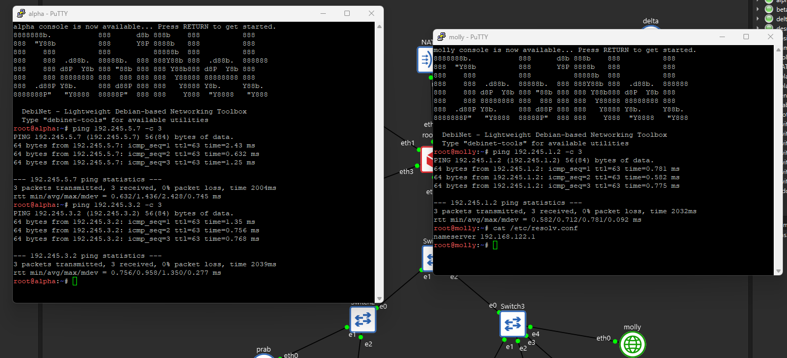

| Uji | Hasil |
|---|---|
| alpha → molly (subnet 1 ke 5) | berhasil, ttl 63 |
| alpha → abbey (subnet 1 ke 3) | berhasil, ttl 63 |
| molly → alpha | berhasil, arah sebaliknya |
| `cat /etc/resolv.conf` | resolver terpasang otomatis |

Nilai **ttl 63** menunjukkan paket melewati tepat satu router, sesuai rancangan.

---

## Soal 4 — Zona DNS Master dan Slave

> Pada node prab, bangun zona `K68.com` sebagai authoritative dengan SOA yang menunjuk ke `prab.K68.com`, tambahkan NS untuk prab dan tedd, A record untuk keduanya, serta A record apex yang mengarah ke penny. Aktifkan notify dan allow-transfer ke tedd, set forwarders ke 192.168.122.1. Di tedd, tarik zona sebagai slave.

### Pengerjaan

Seluruh konfigurasi BIND ditulis melalui script di `/root`, bukan diketik ke `/etc/bind`, karena direktori tersebut hilang setiap node restart.

**prab (ns1, master)** — [`config/prab/setup-dns.sh`](config/prab/setup-dns.sh)

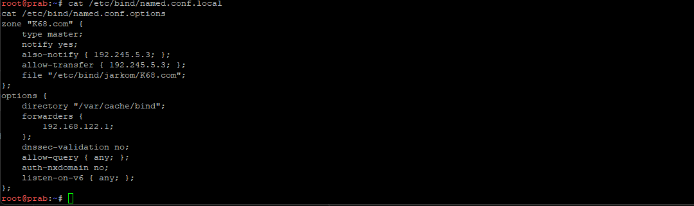

`notify yes` membuat master mengabari slave setiap zona berubah, `also-notify` menyebut alamat slave secara eksplisit, dan `allow-transfer` memberi izin slave menarik salinan zona. Ketiganya harus ada — tanpa `allow-transfer`, notify tetap terkirim tetapi transfer akan ditolak.

`forwarders` mengarahkan pertanyaan di luar zona `K68.com` ke DNS milik NAT, sehingga node tetap dapat membuka alamat internet meski resolver-nya sudah diarahkan ke prab.

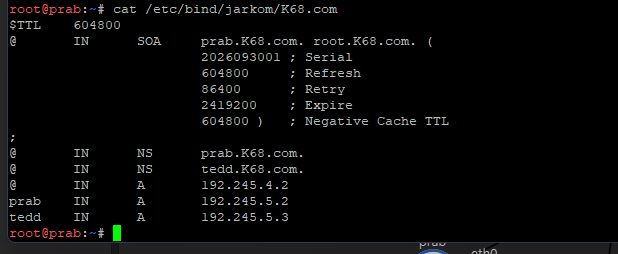

**tedd (ns2, slave)** — [`config/tedd/setup-dns.sh`](config/tedd/setup-dns.sh)

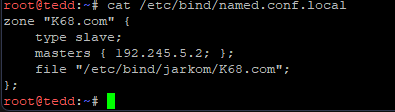

Baris `chown -R bind:bind /etc/bind/jarkom` bersifat wajib pada slave. File hasil zone transfer ditulis oleh proses `named` yang berjalan sebagai user `bind`; tanpa kepemilikan yang benar, transfer akan gagal dan zona tidak pernah termuat.

Setelah zona berdiri, resolver di seluruh node non-router diurutkan ulang menjadi prab, tedd, lalu 192.168.122.1.

### Pengujian

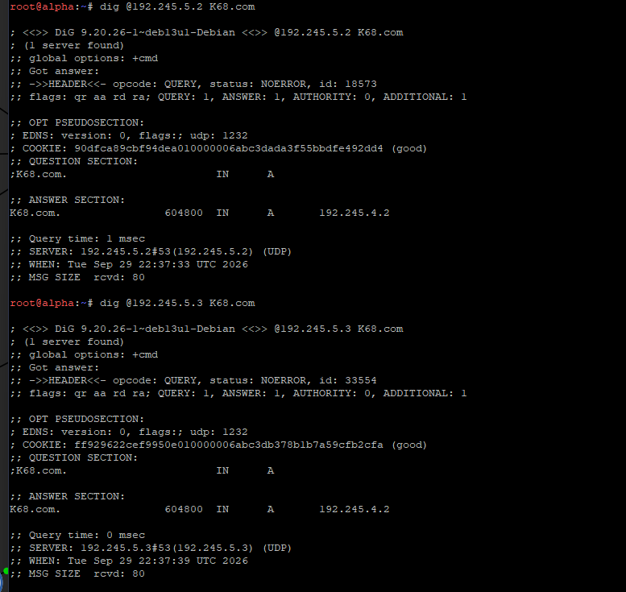

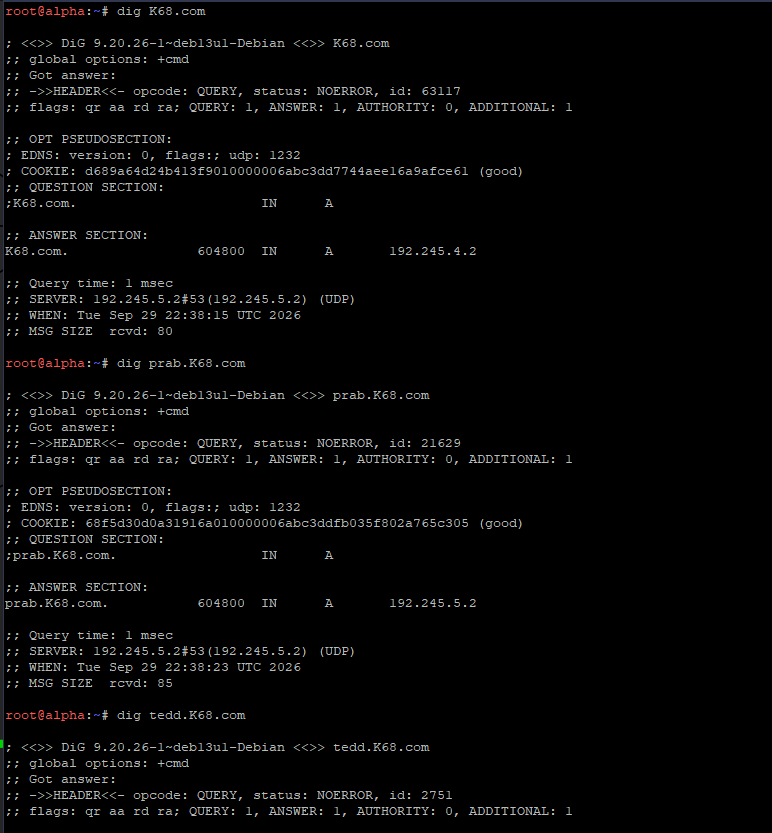

| Uji | Hasil |
|---|---|
| `dig @192.245.5.2 K68.com` | apex → 192.245.4.2, flag `aa` |
| `dig @192.245.5.3 K68.com` | jawaban identik dari slave, flag `aa` |
| `dig K68.com` tanpa `@` | dijawab lewat resolver, flag `aa` |
| `dig prab.K68.com` / `dig tedd.K68.com` | sesuai alamat masing-masing |

Flag **`aa`** (authoritative answer) pada jawaban kedua server menandakan keduanya benar-benar memegang zona, bukan sekadar meneruskan atau menyajikan cache.

---

## Soal 5 — Hostname dan Domain per Node

> Namai semua Entitas sesuai glosarium dan verifikasi bahwa setiap host mengenali hostname tersebut secara system-wide. Buat domain untuk masing-masing node beserta IP-nya. Lakukan pengecualian untuk prab dan tedd.

### Pengerjaan

Hostname pendek setiap node sudah benar sejak awal karena GNS3 menetapkannya dari nama node, terbukti dari prompt `root@alpha:~#`.

Yang belum terpenuhi adalah pengenalan **system-wide**: `hostname -f` masih mengembalikan nama pendek. Penyebabnya, `/etc/hosts` bawaan container hanya memuat pasangan alamat dan nama pendek, dan `hostname -f` membaca `/etc/hosts` lebih dahulu daripada DNS. Menambahkan `search` saja tidak menolong karena berkas lokal selalu diperiksa lebih dulu.

Penyelesaiannya menambahkan penulisan `/etc/hosts` ke dalam `dns.sh` yang sudah terpasang — [`config/dns.sh`](config/dns.sh):

```bash
echo "search K68.com" > /etc/resolv.conf
echo "nameserver 192.245.5.2" >> /etc/resolv.conf
echo "nameserver 192.245.5.3" >> /etc/resolv.conf
echo "nameserver 192.168.122.1" >> /etc/resolv.conf

NAME=$(hostname -s)
IP=$(hostname -I | awk '{print $1}')
grep -vw "$NAME" /etc/hosts > /root/hosts.tmp
echo "$IP $NAME.K68.com $NAME" >> /root/hosts.tmp
cat /root/hosts.tmp > /etc/hosts
```

Script dibuat generik — membaca hostname dan alamat node sendiri — sehingga isinya identik di ketiga belas node dan tidak perlu disesuaikan satu per satu.

Selanjutnya dua belas A record ditambahkan ke zona. **prab dan tedd dikecualikan** karena keduanya sudah memiliki A record sejak soal 4; menambahkannya lagi akan menghasilkan duplikat. Serial dinaikkan dari `2026093001` menjadi `2026093002`.

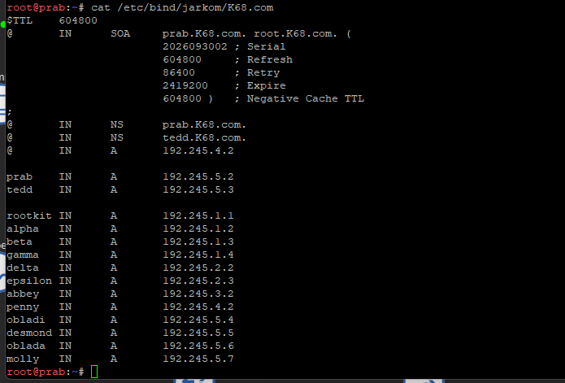

Perlu dibedakan: pengecualian ini hanya berlaku untuk A record di zona. Untuk `dns.sh`, prab dan tedd **tetap ikut** karena soal 4 meminta resolver diurutkan ulang pada seluruh Entitas non-router.

### Pengujian

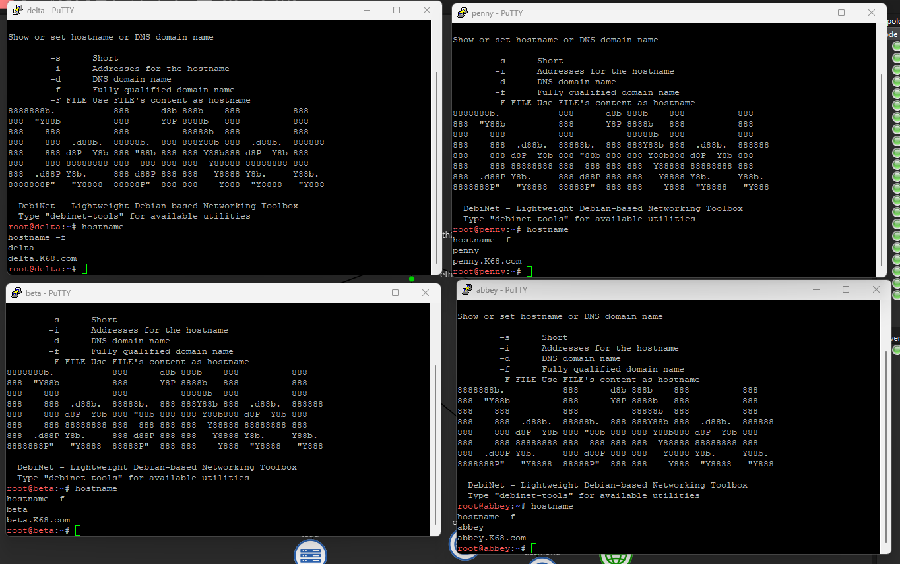

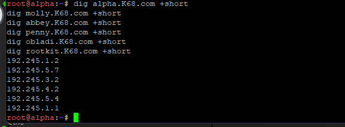

| Uji | Hasil |
|---|---|
| `hostname -f` di delta, penny, beta, abbey | mengembalikan FQDN lengkap |
| `dig <node>.K68.com +short` | seluruh node sesuai tabel alamat |

### Kendala yang ditemui

Setelah konfigurasi diperbarui, seluruh kueri DNS gagal dengan `connection refused` dari prab maupun tedd.

Pemeriksaan pertama di tedd menghasilkan ratusan baris `line 1: syntax error` dari `named-checkzone`. **Diagnosa ini menyesatkan.** File zona pada server slave disimpan BIND dalam format raw (biner), bukan teks, sehingga `named-checkzone` memang tidak dapat membacanya. Error tersebut normal dan bukan penyebab masalah.

Pemeriksaan ulang dilakukan di master. File zona terbukti sehat — 27 baris, `named-checkzone` mengembalikan `OK`, serial terbaca `2026093002`. Yang bermasalah adalah `service bind9 status` yang melaporkan `bind is not running`. Node sempat dimatikan untuk mengedit `interfaces`, dan BIND tidak menyala otomatis saat node dihidupkan kembali. Perbaikannya menjalankan `service bind9 start` di prab dan tedd.

Urutan diagnosa yang benar untuk kasus DNS mati: periksa status service di **master** lebih dahulu, jalankan `named-checkzone` hanya di master, baru periksa slave.

---

## Soal 6 — Verifikasi Zone Transfer

> Pastikan zone transfer berjalan dan tedd telah menerima salinan zona terbaru dari prab. Nilai serial SOA di keduanya harus sama.

### Pengerjaan

Soal ini tidak memerlukan konfigurasi baru. Seluruh mekanismenya sudah dipasang pada soal 4: `notify yes`, `also-notify`, dan `allow-transfer` di sisi master, serta `type slave` dan `masters` di sisi slave.

Yang dibuktikan adalah bahwa mekanisme tersebut benar-benar bekerja: serial di tedd ikut naik menjadi `2026093002` setelah zona diubah pada soal 5, **tanpa disentuh secara manual**.

### Pengujian

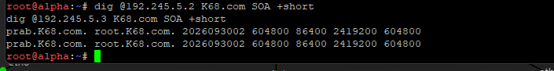

```
dig @192.245.5.2 K68.com SOA +short
dig @192.245.5.3 K68.com SOA +short
```

Kedua server mengembalikan serial `2026093002`.

Log transfer tidak dapat dilampirkan karena container DebiNet tidak menjalankan syslog (`/var/log/syslog` tidak tersedia) maupun systemd (`journalctl` tidak tersedia). Hal ini normal untuk image tersebut. Kesamaan serial sudah merupakan bukti yang cukup, sebab nilai itu mustahil sama apabila transfer gagal.

---

## Soal 7 — Record vault, core, dan CNAME

> Tambahkan A record untuk `vault.K68.com` (IP obladi dan desmond) dan `core.K68.com` (IP oblada dan molly). Tetapkan CNAME `www` ke penny dan `static` ke abbey. Verifikasi dari dua klien berbeda.

### Pengerjaan

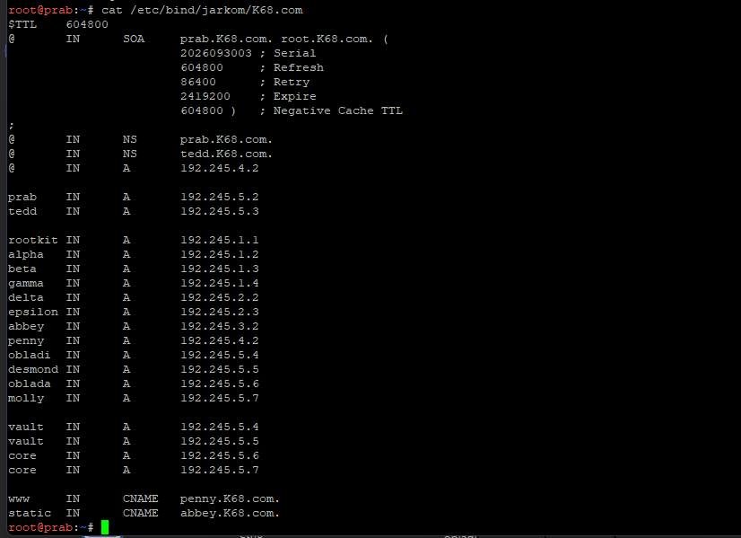

```
vault   IN      A       192.245.5.4
vault   IN      A       192.245.5.5
core    IN      A       192.245.5.6
core    IN      A       192.245.5.7

www     IN      CNAME   penny.K68.com.
static  IN      CNAME   abbey.K68.com.
```

`vault` dan `core` masing-masing memiliki **dua A record** karena kedua area tersebut terdiri dari sepasang node, bukan satu. Satu nama dengan dua A record membuat DNS memutar urutan jawaban setiap kali ditanya, dan inilah dasar pembagian beban yang dipakai pada soal 11.

Kedua CNAME **wajib diakhiri titik**. Tanpa titik penutup, BIND memperlakukan nilainya sebagai nama relatif dan menambahkan nama zona sekali lagi, sehingga `penny.K68.com` menjadi `penny.K68.com.K68.com`.

Serial dinaikkan menjadi `2026093003`.

### Pengujian

Soal meminta verifikasi dari dua klien berbeda, dilakukan dari **alpha** (subnet 1) dan **delta** (subnet 2).

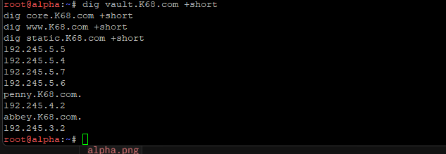

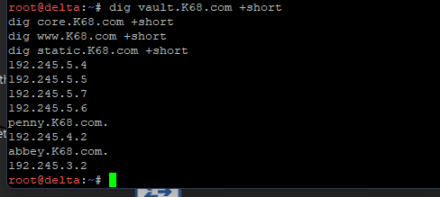

| Nama | Hasil |
|---|---|
| `vault.K68.com` | 192.245.5.4 dan 192.245.5.5 |
| `core.K68.com` | 192.245.5.6 dan 192.245.5.7 |
| `www.K68.com` | `penny.K68.com.` → 192.245.4.2 |
| `static.K68.com` | `abbey.K68.com.` → 192.245.3.2 |

Urutan kedua alamat pada `vault` berbeda antara alpha dan delta. Ini bukan ketidakkonsistenan melainkan **round-robin** DNS yang bekerja sebagaimana mestinya — himpunan jawabannya identik, hanya urutannya yang diputar.

---

## Soal 8 — Reverse Zone dan PTR

> Deklarasikan reverse zone untuk segmen jaringan tempat abbey, penny, area vault, dan area core berada. Tarik sebagai slave di tedd, isi PTR untuk keempat hostname itu, dan pastikan query reverse dijawab authoritative.

### Pertimbangan

Soal menyebut "segmen" dalam bentuk tunggal, sementara keempat entitas tersebar di tiga subnet berbeda: abbey di `192.245.3.0/24`, penny di `192.245.4.0/24`, serta area vault dan core di `192.245.5.0/24`.

Diputuskan membuat **tiga reverse zone**, satu untuk setiap /24. Dasarnya, modul DNS mengajarkan pola reverse berbasis tiga byte pertama alamat, dan tiga zona memastikan seluruh alamat yang diminta tercakup.

Alternatif berupa satu zona pada level `245.192.in-addr.arpa` — mencakup seluruh `/16` sekaligus — secara teknis sah dan lebih literal terhadap kata "segmen" tunggal, namun menyimpang dari pola yang diajarkan modul sehingga tidak dipilih.

Record PTR diarahkan ke **nama node**, bukan ke `vault.K68.com` atau `core.K68.com`. Glosarium mendefinisikan area vault sebagai kelompok node obladi dan desmond, sehingga "PTR untuk area vault" berarti PTR bagi kedua node tersebut. Ini juga sesuai konvensi DNS: PTR menunjuk ke nama kanonik sebuah host, bukan ke nama bersama yang memiliki banyak A record.

### Pengerjaan

**prab** — [`config/prab/setup-dns.sh`](config/prab/setup-dns.sh)

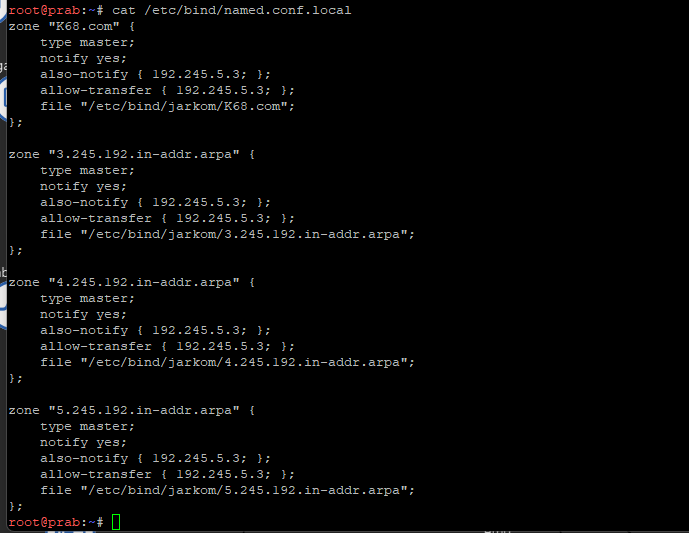

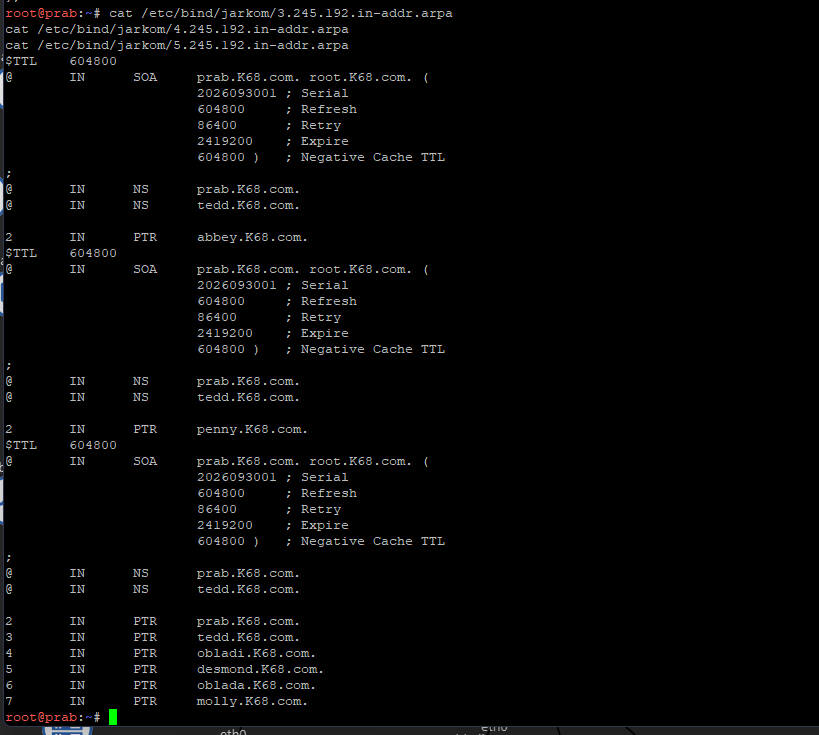

| Zona | Isi |
|---|---|
| `3.245.192.in-addr.arpa` | `2 → abbey.K68.com.` |
| `4.245.192.in-addr.arpa` | `2 → penny.K68.com.` |
| `5.245.192.in-addr.arpa` | `2 → prab`, `3 → tedd`, `4 → obladi`, `5 → desmond`, `6 → oblada`, `7 → molly` |

prab dan tedd turut dimasukkan ke zona `.5` meski tidak diminta soal, agar zona tersebut lengkap untuk seluruh penghuni subnetnya.

**tedd** — [`config/tedd/setup-dns.sh`](config/tedd/setup-dns.sh)

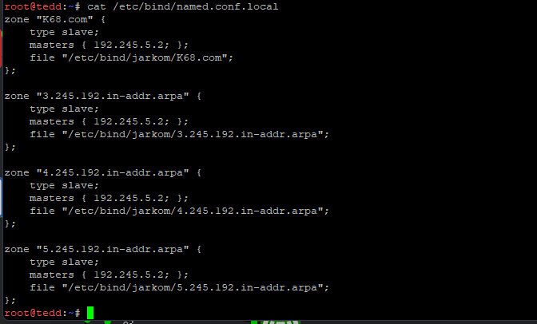

### Pengujian

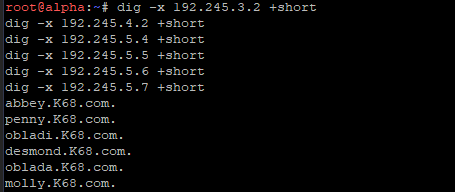

| Alamat | Hasil |
|---|---|
| 192.245.3.2 | `abbey.K68.com.` |
| 192.245.4.2 | `penny.K68.com.` |
| 192.245.5.4 | `obladi.K68.com.` |
| 192.245.5.5 | `desmond.K68.com.` |
| 192.245.5.6 | `oblada.K68.com.` |
| 192.245.5.7 | `molly.K68.com.` |

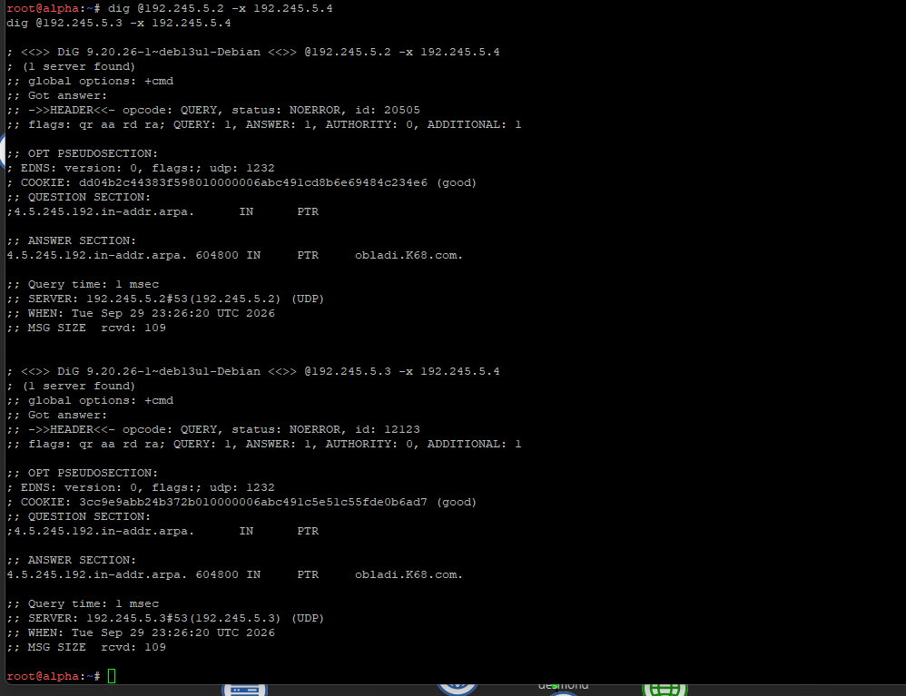

`dig @192.245.5.2 -x 192.245.5.4` dan `dig @192.245.5.3 -x 192.245.5.4` keduanya mengembalikan flag **`aa`**, membuktikan kueri reverse dijawab secara authoritative oleh master maupun slave.

---

## Soal 9 — Web Statis dan Autoindex

> Jalankan layanan web statis pada hostname di node area vault menggunakan Apache. Buka folder `/arsip/` dan aktifkan autoindex sehingga daftar file dapat ditelusuri dari browser. Akses pengujian harus melalui hostname, bukan IP address.

> **Koreksi soal.** Naskah soal menyebut "aktifkan fitur autoindex pada konfigurasi Nginx". Asisten (rootkids) mengoreksi hal ini di Discord: *"sorry pake apache yaa, belom diganti hehe"*. Pengerjaan menggunakan **Apache**.

### Pengerjaan

Area vault terdiri dari obladi dan desmond, dan keduanya dikonfigurasi.

**obladi dan desmond** — [`config/web/setup-web.sh`](config/web/setup-web.sh)

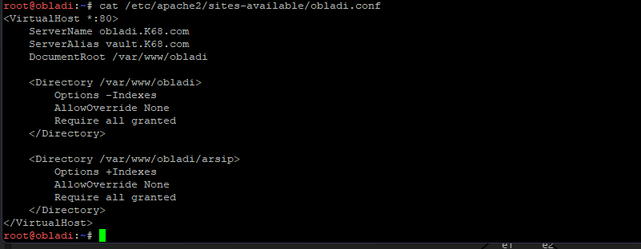

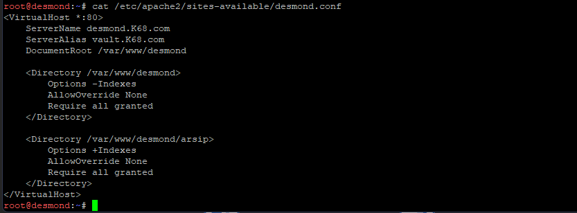

Script dibuat generik dengan membaca hostname node sendiri, sehingga perintah yang dijalankan di kedua node identik dan menghasilkan `ServerName` yang berbeda secara otomatis.

Kunci soal ini terletak pada pemisahan dua blok `Directory`:

```apache
<Directory /var/www/obladi>
    Options -Indexes
</Directory>

<Directory /var/www/obladi/arsip>
    Options +Indexes
</Directory>
```

Hanya `/arsip` yang menampilkan daftar isi. Apabila `-Indexes` pada blok DocumentRoot terlewat, halaman utama pun ikut menampilkan daftar direktori, dan itu tidak sesuai permintaan soal.

`ServerAlias vault.K68.com` ditambahkan agar kedua node juga menanggapi permintaan yang datang atas nama areanya, yang diperlukan untuk reverse proxy pada soal 11.

### Pengujian

Seluruh pengujian dilakukan **melalui hostname**, sesuai permintaan eksplisit soal.

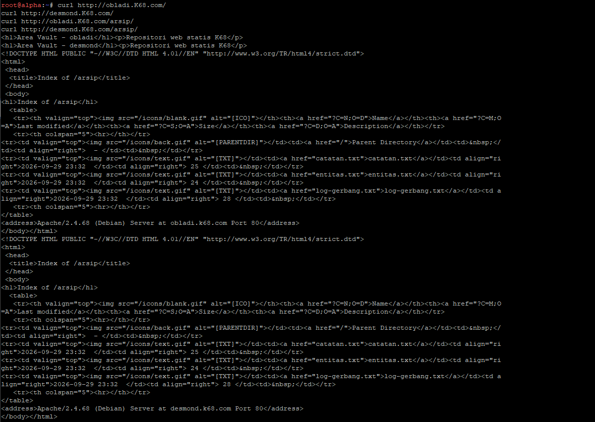

| Alamat | Hasil |
|---|---|
| `http://obladi.K68.com/` | halaman teks "Area Vault - obladi", bukan daftar direktori |
| `http://desmond.K68.com/` | halaman teks "Area Vault - desmond" |
| `http://obladi.K68.com/arsip/` | `Index of /arsip` berisi tiga berkas |
| `http://desmond.K68.com/arsip/` | `Index of /arsip` berisi tiga berkas |

Penelusuran dari browser menggunakan `lynx`:

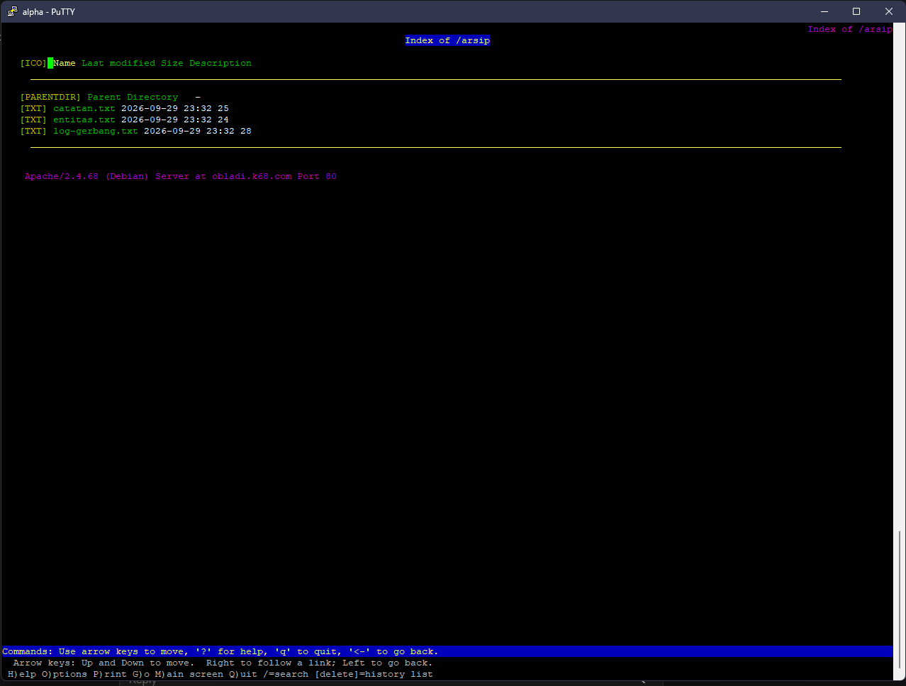

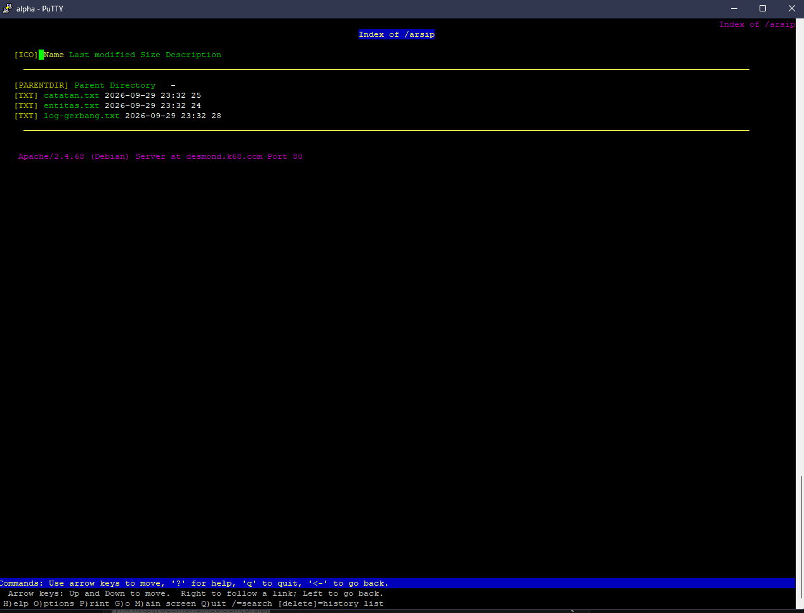

Daftar berkas tampil sebagai tautan yang dapat dibuka, dan footer Apache menunjukkan server yang melayani adalah `obladi.k68.com` dan `desmond.k68.com` — bukan alamat IP.

---

## Soal 10 — Web Dinamis dan Rewrite URL

> Jalankan layanan web dinamis (PHP-FPM) pada hostname di node core (menggunakan nginx). Buat sebuah aplikasi sederhana yang memuat halaman beranda dan halaman profil. Terapkan aturan rewrite pada server sehingga akses ke /profil dapat berfungsi dengan URL bersih (tanpa akhiran .php). Akses pengujian wajib dilakukan melalui hostname.

### Pengerjaan

Area core terdiri dari sepasang node repositori web dinamis: **oblada** (`192.245.5.6`) dan **molly** (`192.245.5.7`). Keduanya dikonfigurasi menggunakan **Nginx** dan **PHP 8.4-FPM** sesuai anjuran glosarium.

Aplikasi sederhana dibuat dengan dua halaman:
1. `/var/www/<node>/index.php`: Halaman beranda yang menampilkan nama node dan status layanan.
2. `/var/www/<node>/profil.php`: Halaman profil yang menampilkan FQDN hostname dan waktu server dinamis melalui fungsi `date()`.

Kunci dari URL bersih (Clean URL) terletak pada direktif `try_files` di dalam blok `location /`:

```nginx
location / {
    try_files $uri $uri/ $uri.php?$args;
}
```

Ketika klien meminta `/profil`, Nginx terlebih dahulu memeriksa apakah ada berkas `/profil` atau direktori `/profil/`. Karena tidak ada, Nginx mencoba mencari `$uri.php` (`/profil.php`). Berkas tersebut ditemukan dan langsung dialihkan ke blok FastCGI PHP 8.4-FPM tanpa memerlukan ekstensi `.php` pada URL peramban.

Seluruh konfigurasi dibungkus dalam script di `/root/setup-core.sh` yang bersifat generik dengan membaca `$(hostname -s)`, sehingga isi script identik di oblada maupun molly.

**oblada dan molly** — [`config/core/setup-core.sh`](config/core/setup-core.sh)

```bash
#!/bin/bash

NODE_NAME=$(hostname -s)
WEB_ROOT="/var/www/$NODE_NAME"

mkdir -p "$WEB_ROOT"

cat > "$WEB_ROOT/index.php" << 'EOF'
<!DOCTYPE html>
<html>
<head><title>Beranda Core</title></head>
<body>
    <h1>Selamat Datang di Area Core</h1>
    <p>Node: <?php echo gethostname(); ?></p>
    <p>Status: Web Dinamis PHP 8.4-FPM Aktif</p>
    <p><a href="/profil">Ke Halaman Profil (Clean URL)</a></p>
</body>
</html>
EOF

cat > "$WEB_ROOT/profil.php" << 'EOF'
<!DOCTYPE html>
<html>
<head><title>Profil Node Core</title></head>
<body>
    <h1>Halaman Profil Entitas</h1>
    <p>Identitas Hostname: <strong><?php echo gethostname(); ?>.K68.com</strong></p>
    <p>Waktu Server: <?php echo date('Y-m-d H:i:s'); ?></p>
    <p><a href="/">Kembali ke Beranda</a></p>
</body>
</html>
EOF

chown -R www-data:www-data "$WEB_ROOT"
chmod -R 755 "$WEB_ROOT"

service php8.4-fpm start

cat > /etc/nginx/sites-available/core << EOF
server {
    listen 80;
    server_name ${NODE_NAME}.K68.com ${NODE_NAME}.k68.com core.K68.com core.k68.com;

    root $WEB_ROOT;
    index index.php index.html;

    location / {
        try_files \$uri \$uri/ \$uri.php?\$args;
    }

    location ~ \.php$ {
        include snippets/fastcgi-php.conf;
        fastcgi_pass unix:/run/php/php8.4-fpm.sock;
    }

    location ~ /\.ht {
        deny all;
    }
}
EOF

ln -sf /etc/nginx/sites-available/core /etc/nginx/sites-enabled/
rm -f /etc/nginx/sites-enabled/default

service php8.4-fpm restart
service nginx restart
```

### Pengujian


---

## Soal 11 — Reverse Proxy dan Load Balancer

> Konfigurasikan Penny (menggunakan Apache) sebagai reverse proxy yang mengarah ke semua node di area vault (Obladi & Desmond). Sementara itu, konfigurasikan Abbey (menggunakan Nginx) sebagai reverse proxy menuju area core (Oblada & Molly). Pastikan kedua gerbang ini meneruskan identitas asli pengunjung ke server backend dengan melakukan forwarding header Host dan X-Real-IP. Buktikan bahwa Penny dan Abbey berhasil mendistribusikan lalu lintas dengan tepat.

### Pengerjaan

Dua gerbang penyaring dikonfigurasi sebagai reverse proxy dan load balancer menggunakan dua teknologi web server berbeda:

1. **Penny (`192.245.4.2`) — Apache Reverse Proxy:**
   Menggunakan modul Apache: `proxy`, `proxy_http`, `proxy_balancer`, `lbmethod_byrequests`, dan `headers`.
   - Mengelompokkan backend area vault (`http://192.245.5.4:80` dan `http://192.245.5.5:80`) ke dalam satu cluster load balancer dengan metode `byrequests` (round-robin).
   - Meneruskan header identitas asli pengunjung dengan `ProxyPreserveHost On` (header `Host`) dan `RequestHeader set X-Real-IP %{REMOTE_ADDR}s` (header `X-Real-IP`).

2. **Abbey (`192.245.3.2`) — Nginx Reverse Proxy:**
   Menggunakan blok `upstream core_backend` yang mengarah ke `192.245.5.6:80` (oblada) dan `192.245.5.7:80` (molly).
   - Nginx mendistribusikan beban secara default menggunakan round-robin.
   - Meneruskan identitas pengunjung melalui:
     ```nginx
     proxy_set_header Host $host;
     proxy_set_header X-Real-IP $remote_addr;
     proxy_set_header X-Forwarded-For $proxy_add_x_forwarded_for;
     ```

**Penny** — [`config/proxy/setup-penny.sh`](config/proxy/setup-penny.sh)

```bash
#!/bin/bash

a2enmod proxy proxy_http proxy_balancer lbmethod_byrequests headers

cat > /etc/apache2/sites-available/penny-proxy.conf << 'EOF'
<VirtualHost *:80>
    ServerName penny.K68.com
    ServerAlias www.K68.com

    ProxyPreserveHost On
    RequestHeader set X-Real-IP %{REMOTE_ADDR}s

    <Proxy balancer://vaultcluster>
        BalancerMember http://192.245.5.4:80
        BalancerMember http://192.245.5.5:80
        ProxySet lbmethod=byrequests
    </Proxy>

    ProxyPass / balancer://vaultcluster/
    ProxyPassReverse / balancer://vaultcluster/
</VirtualHost>
EOF

a2ensite penny-proxy.conf
a2dissite 000-default.conf
service apache2 restart
```

**Abbey** — [`config/proxy/setup-abbey.sh`](config/proxy/setup-abbey.sh)

```bash
#!/bin/bash

cat > /etc/nginx/sites-available/abbey-proxy << 'EOF'
upstream core_backend {
    server 192.245.5.6:80;
    server 192.245.5.7:80;
}

server {
    listen 80;
    server_name abbey.K68.com static.K68.com;

    location / {
        proxy_pass http://core_backend;
        proxy_set_header Host $host;
        proxy_set_header X-Real-IP $remote_addr;
        proxy_set_header X-Forwarded-For $proxy_add_x_forwarded_for;
    }
}
EOF

ln -sf /etc/nginx/sites-available/abbey-proxy /etc/nginx/sites-enabled/
rm -f /etc/nginx/sites-enabled/default
service nginx restart
```

### Pengujian


---

## Soal 12 — Basic Authentication (Penny)

> Terdapat ruang khusus di penny yang yang menyimpan dokumen rahasia sindikat, oleh karena itu terapkan perlindungan basic authentication untuk path `/admin`. Akses ke jalur tersebut harus menolak pengunjung tanpa kredensial, dan hanya mengizinkan masuk jika menggunakan credential berikut:
> - Username: `prabs`
> - Password: `pakar_pinter_jadi_gob***`

### Pengerjaan

Perlindungan Basic Authentication diterapkan pada node **Penny** menggunakan utilitas dari Apache (`apache2-utils` / `htpasswd`). Berikut langkah yang dilakukan di dalam `setup-penny.sh`:

1.  **Instalasi & Modul:** Menginstal paket `apache2-utils` dan mengaktifkan modul `auth_basic` serta `authn_file`.
2.  **Pembuatan Kredensial:** Membuat file kredensial di `/etc/apache2/.htpasswd` dengan menjalankan perintah:
    ```bash
    htpasswd -bc /etc/apache2/.htpasswd prabs "pakar_pinter_jadi_gob***"
    ```
3.  **Membuat Direktori Lokal:** Membuat direktori `/var/www/html/admin` agar ada konten yang ditampilkan ketika `/admin` diakses dengan benar.
4.  **Konfigurasi VirtualHost:**
    Karena Penny adalah reverse proxy, secara *default* path `/` diteruskan ke *backend*. Agar `/admin` tidak ikut diteruskan dan bisa dilayani secara lokal dengan autentikasi, ditambahkan aturan pengecualian sebelum `ProxyPass /`:
    ```apache
    ProxyPass /admin !
    Alias /admin /var/www/html/admin

    <Directory /var/www/html/admin>
        AuthType Basic
        AuthName "Restricted Area"
        AuthUserFile /etc/apache2/.htpasswd
        Require valid-user
    </Directory>
    ```

Dengan ini, siapapun yang mencoba mengakses `http://penny.K68.com/admin` atau lewat IP-nya akan dihadapkan pada prompt *Basic Auth*.


### Pengujian


---

## Soal 13 — Redirection (Penny & Abbey)

> Setiap entitas dari luar harus memanggil gerbang dengan nama kanoniknya. Jika ada yang mencoba mengakses IP penny dan domain `penny.K68.com`, paksa sistem untuk melakukan redirect secara permanen (status code 301) menuju `www.K68.com`. Sebaliknya, jika ada yang mengakses IP abbey dan domain `abbey.K68.com`, lakukan redirect sementara (status code 302) menuju `static.K68.com`.

### Pengerjaan

Aturan *Redirection* (pengalihan HTTP) dikonfigurasi pada kedua *reverse proxy*:

1.  **Penny (Apache) — Redirect 301 (Permanent):**
    Di dalam `setup-penny.sh`, diaktifkan modul `rewrite`. Konfigurasi VirtualHost ditambahkan aturan `RewriteCond` dan `RewriteRule` untuk mendeteksi akses ke IP `192.245.4.2` atau domain `penny.K68.com`, lalu mengalihkannya ke `www.K68.com`.
    ```apache
    RewriteEngine On
    RewriteCond %{HTTP_HOST} ^penny\.K68\.com$ [NC,OR]
    RewriteCond %{HTTP_HOST} ^192\.245\.4\.2$
    RewriteRule ^(.*)$ http://www.K68.com$1 [R=301,L]
    ```

2.  **Abbey (Nginx) — Redirect 302 (Temporary):**
    Di dalam `setup-abbey.sh`, pada blok `server`, ditambahkan kondisi `if` untuk memeriksa variabel `$host`. Jika *host* yang diminta adalah IP `192.245.3.2` atau domain `abbey.K68.com`, *request* langsung dikembalikan dengan status `302` menuju `static.K68.com` beserta URI aslinya.
    ```nginx
    if ($host = "abbey.K68.com") {
        return 302 http://static.K68.com$request_uri;
    }
    if ($host = "192.245.3.2") {
        return 302 http://static.K68.com$request_uri;
    }
    ```

---

### Pengujian


---

## Soal 14 — Forwarding Real IP ke Access Log Backend

> Di dalam The Mesh, rekam jejak tidak boleh dipalsukan oleh sistem. Pastikan access log pada setiap server web di area vault maupun area core mencatat alamat IP asli milik client (pengunjung) yang diteruskan oleh gerbang, dan bukan mencatat IP dari Penny ataupun Abbey.

### Pengerjaan

Secara bawaan, karena *request* dialirkan melalui *reverse proxy*, server *backend* akan mencatat IP milik *proxy* tersebut sebagai pengunjungnya. Karena Penny dan Abbey sudah diinstruksikan untuk meneruskan *header* IP asli klien (via `X-Real-IP`), server *backend* harus dikonfigurasi untuk membaca *header* tersebut dan mengganti *client IP* bawaannya dengan IP tersebut untuk keperluan *logging*.

1.  **Area Vault (obladi & desmond) — Apache:**
    Pada node Apache di area vault, modul `remoteip` diaktifkan untuk menerjemahkan alamat klien secara otomatis berdasarkan header yang diteruskan oleh Penny (`192.245.4.2`).
    
    Perintah yang ditambahkan di `setup-web.sh`:
    ```bash
    a2enmod remoteip
    cat > /etc/apache2/conf-available/remoteip.conf << 'EOF'
    RemoteIPHeader X-Real-IP
    RemoteIPInternalProxy 192.245.4.2
    EOF
    a2enconf remoteip

    # Mengubah format log bawaan Apache agar memakai variabel %a (client IP aktual)
    sed -i 's/LogFormat "%h /LogFormat "%a /g' /etc/apache2/apache2.conf
    ```

2.  **Area Core (oblada & molly) — Nginx:**
    Nginx menggunakan modul *Real IP* (secara otomatis sudah ada di *build* bawaan Nginx) untuk membaca IP pengunjung yang diteruskan oleh Abbey (`192.245.3.2`).
    
    Baris berikut disematkan di dalam blok `server` pada konfigurasi Nginx di `setup-core.sh`:
    ```nginx
    set_real_ip_from 192.245.3.2;
    real_ip_header X-Real-IP;
    ```

Setelah di-restart, baik Apache maupun Nginx akan mencatat IP yang ada di header `X-Real-IP` (misal dari node alpha atau rootkit) ke dalam file *access log* (misal `/var/log/apache2/access.log` atau `/var/log/nginx/access.log`), mengabaikan IP Penny/Abbey sebagai alamat koneksi TCP.

---

### Pengujian


---

## Soal 15 — Jalur Proxy Khusus (Standalone)

> Rootkit menginstruksikan pembuatan jalur proxy khusus yang berdiri sendiri. Pada penny buat reverse proxy untuk path `/eternal` yang menyajikan directory `/var/www/eternal`, dan pastikan path ini dapat mengeksekusi (rendering) file `php`. Pada abbey, buat jalur `/orion` yang menyajikan directory `/var/www/orion`, secara murni statis tanpa perlu rendering php.

### Pengerjaan

Meskipun Penny dan Abbey berfungsi sebagai *reverse proxy* secara global, mereka juga dapat menyajikan *file* lokal di _path_ tertentu (bersifat "berdiri sendiri" dari backend).

1.  **Penny (Apache) — Jalur `/eternal` dengan PHP:**
    - Karena menyajikan konten PHP, di dalam `setup-penny.sh` ditambahkan instalasi paket `php` dan `libapache2-mod-php`. Modul PHP diaktifkan via `a2enmod php8.2`.
    - Dibuat direktori `/var/www/eternal` beserta berkas `index.php` berisikan skrip pencatat waktu server.
    - Pada blok VirtualHost `www.K68.com`, akses menuju `/eternal` dikecualikan dari konfigurasi *proxy* (via `ProxyPass /eternal !`) dan diarahkan ke folder lokal menggunakan `Alias`:
      ```apache
      ProxyPass /eternal !
      Alias /eternal /var/www/eternal
      
      <Directory /var/www/eternal>
          Require all granted
      </Directory>
      ```

2.  **Abbey (Nginx) — Jalur `/orion` Murni Statis:**
    - Di dalam `setup-abbey.sh`, dibuat direktori `/var/www/orion` berisi `index.html` statis sederhana.
    - Pada blok `server` milik `static.K68.com`, ditambahkan *location block* sebelum instruksi *proxy pass*:
      ```nginx
      location /orion {
          alias /var/www/orion;
          index index.html;
      }
      ```
      Tanpa instalasi modul PHP, Nginx melayani `/orion` secara murni statis.

---

### Pengujian


---

## Struktur Repository

```
.
├── README.md
├── config/
│   ├── dns.sh                    # resolver + /etc/hosts, identik di 13 node non-router
│   ├── interfaces/               # /etc/network/interfaces seluruh node
│   ├── rootkit/
│   │   ├── interfaces
│   │   ├── nat.sh                # ip_forward + MASQUERADE
│   │   └── hostname.sh           # FQDN rootkit di /etc/hosts
│   ├── prab/setup-dns.sh         # BIND master: zona forward + 3 reverse
│   ├── tedd/setup-dns.sh         # BIND slave
│   └── web/setup-web.sh          # Apache, identik di obladi dan desmond
└── screenshot/                   # bukti pengerjaan soal 1-9
```

### Letak script di dalam node

| Script | Node | Path | Dipanggil dari |
|---|---|---|---|
| `nat.sh` | rootkit | `/root/nat.sh` | `up` di `interfaces` |
| `hostname.sh` | rootkit | `/root/hostname.sh` | `up` di `interfaces` |
| `dns.sh` | 13 node non-router | `/root/dns.sh` | `up` di `interfaces` |
| `setup-dns.sh` | prab, tedd | `/root/setup-dns.sh` | manual |
| `setup-web.sh` | obladi, desmond | `/root/setup-web.sh` | manual |

`setup-dns.sh` dan `setup-web.sh` belum dipasang pemanggilan otomatisnya karena persistensi service setelah restart merupakan lingkup soal 20.
